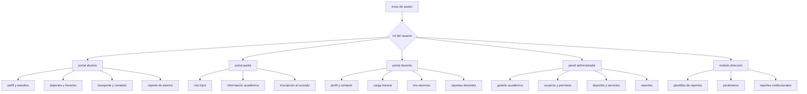
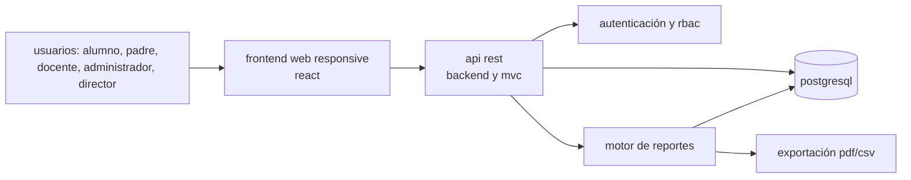
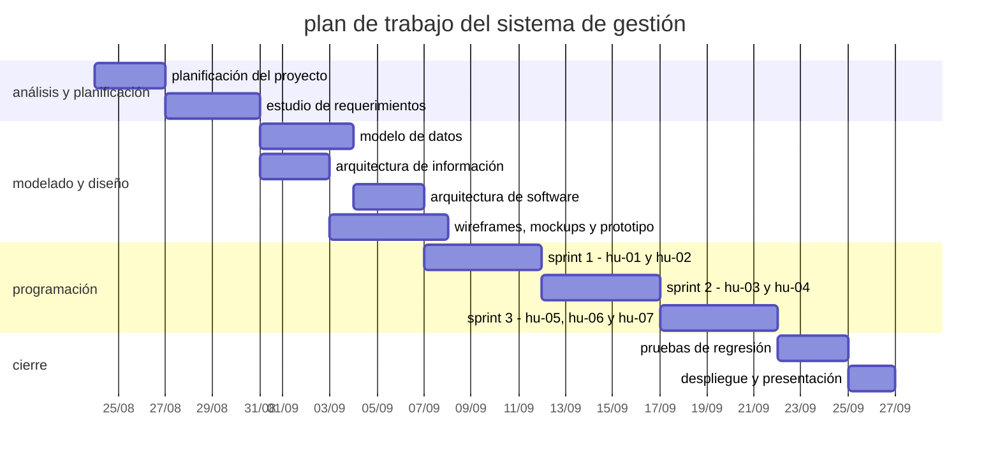
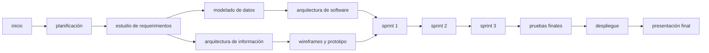

# plan de trabajo - proyecto

## centro educativo "educar para transformar"

### sistema de gestión

## nombre del equipo de trabajo

**equipo de desarrollo del sistema de gestión educativo**

## apellido y nombre del equipo de trabajo

- hakanson, ian
- morales, elias

---

# 1. descripción del proyecto

## 1.1 problema

el centro educativo privado "educar para transformar", ubicado en las afueras de la ciudad de resistencia, iniciará sus actividades en marzo de 2027. la institución necesita automatizar y centralizar sus procesos académicos, administrativos, deportivos y de servicios.

actualmente, la información de alumnos, padres, docentes, cursos, materias, deportes, horarios, transporte y comedor puede encontrarse dispersa y resultar difícil de actualizar o consultar. esta situación puede producir duplicación de datos, errores en las inscripciones, conflictos de horarios y dificultades para generar información para la toma de decisiones.

el proyecto propone desarrollar un sistema web de gestión que permita administrar la información de manera integrada, segura y consistente. el sistema tendrá portales diferenciados para alumnos, padres, docentes, administradores y dirección, con acceso controlado según el rol de cada usuario.

la página web institucional y la aplicación móvil forman parte del escenario general de automatización, pero el alcance de este plan se concentra en el sistema de gestión.

## 1.2 requerimientos funcionales

### alumno

- consultar información personal y académica.
- actualizar correo electrónico y teléfono.
- inscribirse a actividades deportivas.
- inscribirse a un recorrido del servicio de transporte.
- inscribirse al servicio de comedor.
- generar un reporte propio de alumno.

### padre

- consultar profesores y deportes de sus hijos asociados.
- inscribir a sus hijos al cursado del año lectivo.
- acceder exclusivamente a la información de sus hijos.

### docente

- consultar su perfil profesional, materias, cursos y niveles.
- actualizar correo electrónico y teléfono.
- consultar su carga horaria.
- generar listados de alumnos por curso y materia.
- generar un reporte docente.

### administrador

- gestionar alumnos, padres, docentes, niveles, cursos, materias, deportes, horarios e inscripciones.
- gestionar transporte y comedor.
- gestionar usuarios, roles y permisos.
- generar y consultar reportes institucionales autorizados.

### director

- crear, editar, activar y desactivar plantillas de reportes.
- seleccionar entidades y parámetros para los reportes.
- generar reportes institucionales para la toma de decisiones.

## 1.3 requerimientos no funcionales

- el sistema debe autenticar a los usuarios y aplicar control de acceso basado en roles.
- cada usuario debe acceder solo a la información autorizada.
- la base de datos debe mantener integridad referencial y evitar duplicados.
- el sistema debe soportar accesos concurrentes.
- la interfaz debe ser clara y responsive.
- el código debe organizarse por capas y mantenerse en un repositorio versionado.
- las operaciones administrativas importantes deben quedar registradas para auditoría.

## 1.4 reglas de negocio principales

- un alumno puede inscribirse como máximo a dos deportes simultáneamente.
- el sistema debe impedir conflictos de horarios entre actividades deportivas.
- cada alumno pertenece a un único curso.
- cada curso pertenece a un único nivel educativo.
- un padre puede tener uno o varios hijos asociados, pero solo puede consultar y gestionar esos hijos.
- el servicio de transporte tiene exactamente cuatro recorridos.
- no se permiten inscripciones duplicadas.
- cada deporte debe tener un docente responsable.
- un deporte puede tener grupos diferentes según nivel y horario.

## 1.5 tipo de sistema de información

el sistema es de naturaleza híbrida:

- **tps - sistema de procesamiento de transacciones:** procesa inscripciones, altas, modificaciones, asignaciones y uso de servicios.
- **mis - sistema de información gerencial:** transforma los datos operativos en reportes para la administración y la dirección.

## 1.6 arquitectura de la información

la información se organizará mediante portales definidos por rol:

## 1.7 arquitectura de la aplicación de software

### aplicación de principios

- **separación de responsabilidades:** cada capa tendrá una función definida.
- **bajo acoplamiento:** los módulos se comunicarán mediante interfaces claras.
- **alta cohesión:** cada módulo agrupará funcionalidades relacionadas.
- **seguridad por diseño:** la autenticación y autorización se validarán en el backend.
- **integridad de datos:** las reglas críticas se validarán en la lógica de negocio y en la base de datos.
- **responsive design:** las pantallas se adaptarán a computadoras y dispositivos móviles.

### componentes

- aplicación frontend web.
- api rest del backend.
- módulo de autenticación y autorización rbac.
- módulo de alumnos y padres.
- módulo de docentes.
- módulo de administración.
- módulo de dirección.
- motor de reportes.
- base de datos relacional.

### componentes funcionales

1. gestión de usuarios, roles y permisos.
2. gestión académica: niveles, cursos, materias y horarios.
3. gestión de alumnos, padres y docentes.
4. gestión de actividades deportivas.
5. gestión de transporte y comedor.
6. inscripciones y validaciones de negocio.
7. reportes operativos e institucionales.
8. alertas y notificaciones como funcionalidad adicional.

### restricciones

- el sistema debe respetar el acceso basado en roles.
- un alumno no puede superar dos deportes.
- no se permiten conflictos de horarios deportivos.
- un alumno solo puede tener un recorrido de transporte activo.
- deben mantenerse exactamente cuatro recorridos de transporte.
- no deben duplicarse inscripciones ni usuarios según las claves definidas.
- los cambios administrativos deben poder auditarse.

### conectores

- frontend y backend: http/https mediante api rest y json.
- backend y base de datos: orm o repositorio de persistencia.
- backend y motor de reportes: servicio interno con consultas autorizadas.
- equipo y repositorio: git mediante github o gitlab.
- equipo y gestión: tablero kanban en jira, github projects u otra herramienta equivalente.

### tipo de arquitectura de software

se utilizará una arquitectura web de tres capas, complementada con el patrón mvc:

1. **capa de presentación:** interfaz web y componentes visuales.
2. **capa de lógica de negocio:** casos de uso, validaciones, autenticación y autorización.
3. **capa de acceso a datos:** repositorios, orm y base de datos relacional.

### tecnologías previstas

las tecnologías definitivas se seleccionarán durante la etapa de diseño. la propuesta inicial es:

- **backend:** node.js con una api rest.
- **frontend:** react.
- **gestor de base de datos:** postgresql.
- **autenticación:** sesiones seguras o tokens jwt.
- **reportes:** generación en pantalla y exportación opcional a pdf o csv.
- **repositorio:** github.
- **gestión del proyecto:** jira o github projects.

### backend

el backend centralizará la lógica de negocio, validará permisos, gestionará las inscripciones y expondrá los endpoints de la api. las reglas de máximo de deportes, conflictos de horarios, unicidad y relación padre-hijo no dependerán únicamente del frontend.

### frontend

el frontend proporcionará interfaces diferenciadas por rol, formularios de gestión, tablas de consulta, mensajes de validación y visualización de reportes. se priorizará una interfaz responsive y accesible.

### gestor de base de datos

se utilizará postgresql por su soporte para relaciones, restricciones de unicidad, integridad referencial y consultas complejas para reportes.

### maquetación

- **wireframes:** definirán la estructura básica de las pantallas principales.
- **mockups:** representarán la apariencia visual, colores, tipografías y componentes.
- **prototipo:** permitirá simular la navegación y validar los flujos principales antes de codificar.

las pantallas mínimas a prototipar son inicio de sesión, portal del alumno, consulta del padre, portal docente, panel administrador, inscripción deportiva, inscripción al transporte y reportes de dirección.

### repositorio de software

el código se alojará en un repositorio privado de github. se utilizarán ramas para funcionalidades, revisiones mediante pull requests y mensajes de commit descriptivos. también se almacenarán allí el `readme`, la documentación técnica, los diagramas y las evidencias de pruebas.

### gráfico de arquitectura de software

## 1.8 gestión del proyecto

se utilizará un tablero kanban con las columnas **backlog**, **to do**, **in progress**, **review**, **done** y **blocked**. cada tarea tendrá un responsable, estimación, estado y evidencia.

la bitácora deberá registrar:

- reuniones y decisiones del equipo.
- tareas asignadas a cada integrante.
- avances y bloqueos.
- revisiones de código.
- pruebas ejecutadas y resultados.
- entregables de cada sprint.

## 1.9 integrantes y responsabilidades

| integrante | responsabilidades principales |
|---|---|
| ian hakanson | coordinación técnica, modelado de datos, backend, seguridad y documentación de arquitectura |
| elias morales | análisis funcional, frontend, maquetación, pruebas y documentación de historias y casos de uso |
| ambos | planificación, revisión de código, integración, demostraciones y presentación final |

---

# 2. objetivos del proyecto

los objetivos se expresan utilizando el formato smart.

## objetivo general

desarrollar, durante el período académico definido por la cátedra, un sistema web de gestión para "educar para transformar" que centralice la información académica, extracurricular y de servicios, aplicando control de acceso por roles y validaciones de integridad para que la versión demostrable cumpla los criterios de aceptación de las historias priorizadas.

## objetivos específicos

1. **relevante y específico:** analizar y documentar el 100% de los requisitos, reglas de negocio, historias de usuario y casos de uso incluidos en el alcance antes de iniciar la codificación.
2. **medible:** diseñar el modelo de datos, la arquitectura de información, los wireframes, mockups y el prototipo de los flujos principales antes de finalizar la etapa de diseño.
3. **alcanzable:** implementar las siete historias de usuario en tres sprints semanales, priorizando inscripción deportiva, consulta familiar, seguridad, reportes y transporte.
4. **medible:** ejecutar pruebas funcionales, de integración y de permisos para el 100% de los criterios de aceptación antes de la demostración final.
5. **relevante:** entregar una versión desplegada en un entorno de pruebas, con documentación, repositorio, bitácora kanban y evidencias de participación individual.

---

# 3. cronograma de actividades - sistema de gestión

las horas son estimaciones iniciales para el trabajo del equipo. el campo responsable identifica al integrante que coordina la tarea; ambos integrantes participan en las actividades de integración y revisión.

| etapa | tareas | duración en hs | resultados esperados | responsable |
|---|---|---:|---|---|
| planificación del proyecto | definir alcance, equipo, roles, riesgos, repositorio, tablero y calendario | 4 | acta inicial, tablero kanban y repositorio creados | ambos |
| planificación del proyecto | descomponer historias en tareas y estimar puntos y horas | 3 | backlog priorizado y plan de sprints | ian |
| estudio de requerimientos | revisar escenario, requisitos, reglas de negocio y alcance | 5 | requisitos funcionales y no funcionales validados | elias |
| estudio de requerimientos | corregir historias, criterios de aceptación y casos de uso | 6 | catálogo consistente de hu y cu | elias |
| modelado | diseñar modelo entidad-relación y diccionario de datos | 8 | modelo de datos normalizado | ian |
| modelado | modelar roles, permisos, inscripciones y restricciones | 5 | matriz rbac y reglas de integridad | ian |
| modelado | completar arquitectura de información y mapa de navegación | 4 | mapa del sitio lógico | elias |
| diseño | diseñar arquitectura de tres capas y contratos de api | 6 | diagrama técnico y endpoints definidos | ian |
| diseño | crear wireframes, mockups y prototipo navegable | 8 | prototipo de los flujos principales | elias |
| diseño | definir componentes visuales y criterios responsive | 4 | guía visual inicial | elias |
| codificación | configurar proyecto, base de datos y autenticación | 8 | estructura ejecutable y acceso seguro | ian |
| codificación | implementar módulos de alumnos, padres y docentes | 12 | portales y consultas básicas funcionales | ambos |
| codificación | implementar deportes, horarios, transporte y comedor | 12 | inscripciones y validaciones operativas | ian |
| codificación | implementar administración, rbac y reportes | 14 | panel administrativo y reportes funcionales | ambos |
| codificación | implementar frontend y validaciones de formularios | 14 | interfaces responsive conectadas a la api | elias |
| pruebas | crear casos de prueba y datos de prueba | 4 | plan de pruebas y datos controlados | elias |
| pruebas | ejecutar pruebas funcionales y de integración | 10 | evidencias y defectos registrados | ambos |
| pruebas | ejecutar pruebas de permisos, duplicados y conflictos horarios | 6 | reglas críticas verificadas | ian |
| pruebas | corregir errores y realizar regresión | 8 | versión estable candidata a entrega | ambos |
| implementación o despliegue | preparar variables de entorno y base de datos de prueba | 4 | entorno configurado | ian |
| implementación o despliegue | desplegar aplicación y ejecutar smoke tests | 5 | sistema disponible en entorno de pruebas | ian |
| implementación o despliegue | completar documentación, bitácora y presentación | 6 | entrega final completa | ambos |

**estimación total:** 162 horas de trabajo del equipo.

---

# 4. diagrama de gantt

la planificación se distribuye en cinco semanas: análisis y planificación, modelado y diseño, y tres semanas de programación correspondientes a los sprints.

las fechas son referenciales y deben ajustarse al calendario real de la cátedra.

---

# 5. diagrama de pert

la ruta crítica estimada es: planificación, requerimientos, modelado, diseño técnico, sprint 1, sprint 2, sprint 3, pruebas finales y despliegue.

---

# 6. backlog de los sprints

## hu-01 - inscripción a deportes

| id | título / historia de usuario | prioridad | estado |
|---|---|---|---|
| hu-01 | como alumno, quiero inscribirme a actividades deportivas para participar en propuestas extracurriculares | alta | to do |

**tareas:**

1. diseñar catálogo de deportes, grupos y horarios.
2. implementar consulta de actividades disponibles.
3. implementar inscripción deportiva.
4. validar máximo de dos deportes activos.
5. validar conflictos de horarios.
6. registrar deporte, grupo, horario y docente responsable.
7. ejecutar pruebas funcionales y de concurrencia.

**criterios de aceptación:**

- el catálogo muestra deportes y grupos disponibles.
- se bloquea el tercer deporte.
- se bloquean horarios superpuestos.
- la inscripción confirmada queda asociada al alumno.

## hu-02 - consulta de información académica

| id | título / historia de usuario | prioridad | estado |
|---|---|---|---|
| hu-02 | como padre, quiero consultar la información académica y deportiva de mis hijos | alta | to do |

**tareas:**

1. modelar la relación padre-hijo.
2. obtener los hijos asociados al usuario autenticado.
3. mostrar profesores por materia y deportes activos.
4. implementar autorización por relación padre-hijo.
5. probar acceso autorizado y no autorizado.

**criterios de aceptación:**

- el padre visualiza únicamente hijos asociados.
- se muestran profesores y deportes del hijo seleccionado.
- se rechaza el acceso a alumnos no asociados.
- se informa si no existen hijos asociados.

## hu-03 - actualización de datos de contacto

| id | título / historia de usuario | prioridad | estado |
|---|---|---|---|
| hu-03 | como alumno o docente, quiero modificar mi correo y teléfono | media | to do |

**tareas:**

1. crear formulario de edición para ambos roles.
2. validar campos obligatorios y correo electrónico.
3. validar permisos para modificar únicamente el perfil propio.
4. persistir los cambios en la base de datos.
5. mostrar confirmación o errores.
6. ejecutar pruebas de validación.

**criterios de aceptación:**

- el usuario puede modificar sus propios datos.
- un correo inválido no se guarda.
- los cambios válidos se persisten.
- se muestra un mensaje de confirmación.

## hu-04 - gestión de usuarios y roles

| id | título / historia de usuario | prioridad | estado |
|---|---|---|---|
| hu-04 | como administrador, quiero gestionar usuarios y roles para controlar el acceso | crítica | to do |

**tareas:**

1. implementar alta, consulta, edición y desactivación de usuarios.
2. implementar asignación de roles.
3. configurar permisos de alumno, padre, docente, administrador y director.
4. evitar usuarios duplicados.
5. proteger endpoints y vistas según rol.
6. ejecutar pruebas de seguridad y autorización.

**criterios de aceptación:**

- se pueden gestionar usuarios.
- es obligatorio asignar un rol válido.
- cada usuario accede solo a sus funciones autorizadas.
- no se permiten duplicados según las claves definidas.

## hu-05 - listado de alumnos por materia

| id | título / historia de usuario | prioridad | estado |
|---|---|---|---|
| hu-05 | como docente, quiero generar listados de alumnos de mis materias | media | to do |

**tareas:**

1. consultar materias y cursos asignados al docente.
2. generar consulta de alumnos por materia.
3. mostrar nivel, curso, materia, profesor, alumno y legajo.
4. aplicar restricciones de acceso.
5. implementar exportación csv opcional.
6. probar listados con distintos docentes.

**criterios de aceptación:**

- el docente solo ve sus materias y cursos.
- el listado contiene todos los campos requeridos.
- no se expone información de otros docentes.

## hu-06 - inscripción al servicio de transporte

| id | título / historia de usuario | prioridad | estado |
|---|---|---|---|
| hu-06 | como alumno, quiero seleccionar un recorrido de transporte | alta | to do |

**tareas:**

1. configurar los cuatro recorridos disponibles.
2. mostrar recorridos activos.
3. implementar inscripción a un recorrido.
4. validar una única inscripción activa por alumno.
5. evitar duplicados mediante validación y restricción de base de datos.
6. ejecutar pruebas funcionales.

**criterios de aceptación:**

- se muestran exactamente cuatro recorridos.
- el alumno puede seleccionar un recorrido.
- no puede inscribirse dos veces ni tener recorridos simultáneos.
- la inscripción queda registrada correctamente.

## hu-07 - configuración de reportes institucionales

| id | título / historia de usuario | prioridad | estado |
|---|---|---|---|
| hu-07 | como director, quiero configurar plantillas de reportes institucionales | media | to do |

**tareas:**

1. definir entidades y campos disponibles para reportes.
2. crear formulario de configuración de plantilla.
3. validar nombre y selección de parámetros.
4. guardar, editar, activar y desactivar plantillas.
5. generar el reporte desde una plantilla autorizada.
6. probar permisos y resultados.

**criterios de aceptación:**

- el director puede elegir entidad y parámetros.
- no se guarda una plantilla sin nombre o campos.
- las plantillas se pueden administrar.
- solo usuarios autorizados pueden generar reportes.

---

# 7. plan de sprint

## sprint 1 - semana 1

**objetivo:** implementar la inscripción deportiva y la consulta segura de información de los hijos.

**requerimientos incluidos:** hu-01 y hu-02.

| día | actividades | resultado esperado |
|---|---|---|
| 1 | modelo de alumnos, padres, cursos, deportes y horarios | estructura de datos inicial |
| 2 | catálogo de deportes y grupos | actividades disponibles para consulta |
| 3 | inscripción deportiva y límite de dos deportes | inscripción básica funcionando |
| 4 | conflictos horarios y consulta padre-hijo | validaciones y acceso seguro |
| 5 | pruebas, integración y demostración | hu-01 y hu-02 listas para revisión |

## sprint 2 - semana 2

**objetivo:** implementar la actualización de contacto y la gestión segura de usuarios y roles.

**requerimientos incluidos:** hu-03 y hu-04.

| día | actividades | resultado esperado |
|---|---|---|
| 1 | formularios de contacto para alumnos y docentes | edición de datos disponible |
| 2 | validaciones y persistencia | datos válidos almacenados |
| 3 | abm de usuarios | gestión de usuarios funcionando |
| 4 | roles, permisos y protección de endpoints | rbac implementado |
| 5 | pruebas de seguridad, integración y demostración | hu-03 y hu-04 listas para revisión |

## sprint 3 - semana 3

**objetivo:** completar los reportes docentes, el transporte y la configuración de reportes institucionales.

**requerimientos incluidos:** hu-05, hu-06 y hu-07.

| día | actividades | resultado esperado |
|---|---|---|
| 1 | listado de alumnos por materia | reporte docente disponible |
| 2 | filtros y restricciones por docente | información protegida |
| 3 | recorridos e inscripción al transporte | transporte funcionando |
| 4 | plantillas y parámetros de reportes | reportes de dirección configurables |
| 5 | pruebas finales, correcciones y demostración | versión candidata a entrega |

## definición de terminado

una historia se considera terminada cuando cumple sus criterios de aceptación, incluye validaciones de error, fue probada, revisada por el equipo, integrada al repositorio y desplegada en el entorno de pruebas.

---

# 8. entregables

- documento del plan de trabajo.
- requerimientos funcionales y no funcionales.
- historias de usuario y casos de uso.
- modelo de datos y diccionario de datos.
- diagramas de arquitectura de información y software.
- wireframes, mockups y prototipo.
- código fuente en el repositorio.
- tablero kanban y bitácora del equipo e integrantes.
- casos y evidencias de pruebas.
- aplicación desplegada en un entorno de pruebas.
- presentación y demostración final.
