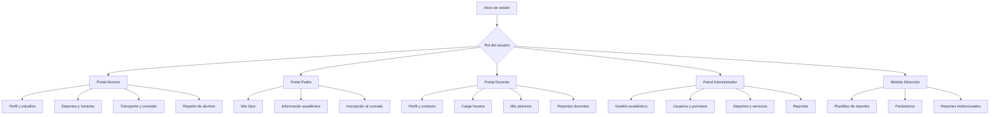
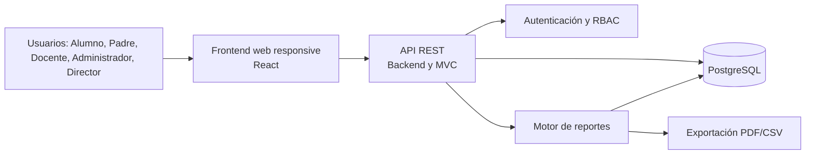
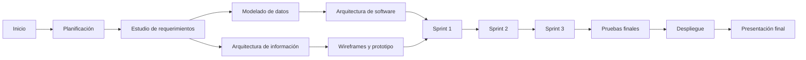

  

    
    
  

  

    <h1>Plan de Trabajo - Proyecto</h1>
    <h2>Centro Educativo "EDUCAR PARA TRANSFORMAR"</h2>
    <h3>Sistema de Gestión</h3>
    
Tecnicatura Universitaria en Programación

    
<strong>Equipo de trabajo</strong>

    
Hakanson, Ian Morales, Elías

  

  <h1>Índice</h1>
  <ul class="index-list">
    <li><a href="#1-descripción-del-proyecto">1. Descripción del Proyecto</a></li>
    <li><a href="#2-objetivos-del-proyecto">2. Objetivos del Proyecto</a></li>
    <li><a href="#3-cronograma-de-actividades---sistema-de-gestión">3. Cronograma de Actividades - Sistema de Gestión</a></li>
    <li><a href="#4-diagrama-de-gantt">4. Diagrama de Gantt</a></li>
    <li><a href="#5-diagrama-de-pert">5. Diagrama de PERT</a></li>
    <li><a href="#6-backlog-de-los-sprints">6. Backlog de los Sprints</a></li>
    <li><a href="#7-plan-de-sprint">7. Plan de Sprint</a></li>
    <li><a href="#8-entregables">8. Entregables</a></li>
  </ul>

# Plan de Trabajo - Proyecto

## Centro Educativo "EDUCAR PARA TRANSFORMAR"

### Sistema de Gestión

## Nombre del Equipo de Trabajo

**Equipo de desarrollo del sistema de gestión educativo**

## Apellido y Nombre del Equipo de Trabajo

- Hakanson, Ian
- Morales, Elías

---

# 1. Descripción del Proyecto

## 1.1 Problema

El centro educativo privado "EDUCAR PARA TRANSFORMAR", ubicado en las afueras de la ciudad de Resistencia, iniciará sus actividades en marzo de 2027. La institución necesita automatizar y centralizar sus procesos académicos, administrativos, deportivos y de servicios.

Actualmente, la información de alumnos, padres, docentes, cursos, materias, deportes, horarios, transporte y comedor puede encontrarse dispersa y resultar difícil de actualizar o consultar. Esta situación puede producir duplicación de datos, errores en las inscripciones, conflictos de horarios y dificultades para generar información para la toma de decisiones.

El proyecto propone desarrollar un sistema web de gestión que permita administrar la información de manera integrada, segura y consistente. El sistema tendrá portales diferenciados para alumnos, padres, docentes, administradores y Dirección, con acceso controlado según el rol de cada usuario.

La página web institucional y la aplicación móvil forman parte del escenario general de automatización, pero el alcance de este plan se concentra en el sistema de gestión.

## 1.2 Requerimientos Funcionales

### Alumno

- Consultar información personal y académica.
- Actualizar correo electrónico y teléfono.
- Inscribirse a actividades deportivas.
- Inscribirse a un recorrido del servicio de transporte.
- Inscribirse al servicio de comedor.
- Generar un reporte propio de alumno.

### Padre

- Consultar profesores y deportes de sus hijos asociados.
- Inscribir a sus hijos al cursado del año lectivo.
- Acceder exclusivamente a la información de sus hijos.

### Docente

- Consultar su perfil profesional, materias, cursos y niveles.
- Actualizar correo electrónico y teléfono.
- Consultar su carga horaria.
- Generar listados de alumnos por curso y materia.
- Generar un reporte docente.

### Administrador

- Gestionar alumnos, padres, docentes, niveles, cursos, materias, deportes, horarios e inscripciones.
- Gestionar transporte y comedor.
- Gestionar usuarios, roles y permisos.
- Generar y consultar reportes institucionales autorizados.

### Director

- Crear, editar, activar y desactivar plantillas de reportes.
- Seleccionar entidades y parámetros para los reportes.
- Generar reportes institucionales para la toma de decisiones.

## 1.3 Requerimientos No Funcionales

- El sistema debe autenticar a los usuarios y aplicar control de acceso basado en roles.
- Cada usuario debe acceder solo a la información autorizada.
- La base de datos debe mantener integridad referencial y evitar duplicados.
- El sistema debe soportar accesos concurrentes.
- La interfaz debe ser clara y responsive.
- El código debe organizarse por capas y mantenerse en un repositorio versionado.
- Las operaciones administrativas importantes deben quedar registradas para auditoría.

## 1.4 Reglas de Negocio Principales

- Un alumno puede inscribirse como máximo a dos deportes simultáneamente.
- El sistema debe impedir conflictos de horarios entre actividades deportivas.
- Cada alumno pertenece a un único curso.
- Cada curso pertenece a un único nivel educativo.
- Un padre puede tener uno o varios hijos asociados, pero solo puede consultar y gestionar esos hijos.
- El servicio de transporte tiene exactamente cuatro recorridos.
- No se permiten inscripciones duplicadas.
- Cada deporte debe tener un docente responsable.
- Un deporte puede tener grupos diferentes según nivel y horario.

## 1.5 Tipo de Sistema de Información

El sistema es de naturaleza híbrida:

- **TPS - Sistema de Procesamiento de Transacciones:** procesa inscripciones, altas, modificaciones, asignaciones y uso de servicios.
- **MIS - Sistema de Información Gerencial:** transforma los datos operativos en reportes para la Administración y la Dirección.

## 1.6 Arquitectura de la Información

La información se organizará mediante portales definidos por rol:

## 1.7 Arquitectura de la Aplicación de Software

### Aplicación de Principios

- **Separación de responsabilidades:** Cada capa tendrá una función definida.
- **Bajo acoplamiento:** Los módulos se comunicarán mediante interfaces claras.
- **Alta cohesión:** Cada módulo agrupará funcionalidades relacionadas.
- **Seguridad por diseño:** La autenticación y autorización se validarán en el backend.
- **Integridad de datos:** Las reglas críticas se validarán en la lógica de negocio y en la base de datos.
- **Responsive design:** Las pantallas se adaptarán a computadoras y dispositivos móviles.

### Componentes

- Aplicación frontend web.
- API REST del backend.
- Módulo de autenticación y autorización RBAC.
- Módulo de alumnos y padres.
- Módulo de docentes.
- Módulo de Administración.
- Módulo de Dirección.
- Motor de reportes.
- Base de datos relacional.

### Componentes Funcionales

1. Gestión de usuarios, roles y permisos.
2. Gestión académica: niveles, cursos, materias y horarios.
3. Gestión de alumnos, padres y docentes.
4. Gestión de actividades deportivas.
5. Gestión de transporte y comedor.
6. Inscripciones y validaciones de negocio.
7. Reportes operativos e institucionales.
8. Alertas y notificaciones como funcionalidad adicional.

### Restricciones

- El sistema debe respetar el acceso basado en roles.
- Un alumno no puede superar dos deportes.
- No se permiten conflictos de horarios deportivos.
- Un alumno solo puede tener un recorrido de transporte activo.
- Deben mantenerse exactamente cuatro recorridos de transporte.
- No deben duplicarse inscripciones ni usuarios según las claves definidas.
- Los cambios administrativos deben poder auditarse.

### Conectores

- Frontend y backend: HTTP/HTTPS mediante API REST y JSON.
- Backend y base de datos: ORM o repositorio de persistencia.
- Backend y motor de reportes: servicio interno con consultas autorizadas.
- Equipo y repositorio: Git mediante GitHub o GitLab.
- Equipo y gestión: tablero Kanban en Jira, GitHub Projects u otra herramienta equivalente.

### Tipo de Arquitectura de Software

Se utilizará una arquitectura web de tres capas, complementada con el patrón MVC:

1. **Capa de presentación:** Interfaz web y componentes visuales.
2. **Capa de lógica de negocio:** Casos de uso, validaciones, autenticación y autorización.
3. **Capa de acceso a datos:** Repositorios, ORM y base de datos relacional.

### Tecnologías Previstas

Las tecnologías definitivas se seleccionarán durante la etapa de diseño. La propuesta inicial es:

- **Backend:** Node.js con una API REST.
- **Frontend:** React.
- **Gestor de base de datos:** PostgreSQL.
- **Autenticación:** Sesiones seguras o tokens JWT.
- **Reportes:** Generación en pantalla y exportación opcional a PDF o CSV.
- **Repositorio:** GitHub.
- **Gestión del proyecto:** Jira o GitHub Projects.

### Backend

El backend centralizará la lógica de negocio, validará permisos, gestionará las inscripciones y expondrá los endpoints de la API. Las reglas de máximo de deportes, conflictos de horarios, unicidad y relación padre-hijo no dependerán únicamente del frontend.

### Frontend

El frontend proporcionará interfaces diferenciadas por rol, formularios de gestión, tablas de consulta, mensajes de validación y visualización de reportes. Se priorizará una interfaz responsive y accesible.

### Gestor de Base de Datos

Se utilizará PostgreSQL por su soporte para relaciones, restricciones de unicidad, integridad referencial y consultas complejas para reportes.

### Maquetación

- **Wireframes:** Definirán la estructura básica de las pantallas principales.
- **Mockups:** Representarán la apariencia visual, colores, tipografías y componentes.
- **Prototipo:** Permitirá simular la navegación y validar los flujos principales antes de codificar.

Las pantallas mínimas a prototipar son inicio de sesión, portal del alumno, consulta del padre, portal docente, panel administrador, inscripción deportiva, inscripción al transporte y reportes de Dirección.

### Repositorio de Software

El código se alojará en un repositorio privado de GitHub. Se utilizarán ramas para funcionalidades, revisiones mediante pull requests y mensajes de commit descriptivos. También se almacenarán allí el `README`, la documentación técnica, los diagramas y las evidencias de pruebas.

### Gráfico de Arquitectura de Software

## 1.8 Gestión del Proyecto

Se utilizará un tablero Kanban con las columnas **Backlog**, **To Do**, **In Progress**, **Review**, **Done** y **Blocked**. Cada tarea tendrá un responsable, estimación, estado y evidencia.

La bitácora deberá registrar:

- Reuniones y decisiones del equipo.
- Tareas asignadas a cada integrante.
- Avances y bloqueos.
- Revisiones de código.
- Pruebas ejecutadas y resultados.
- Entregables de cada sprint.

## 1.9 Integrantes y Responsabilidades

| Integrante | Responsabilidades principales |
|---|---|
| Ian Hakanson | Coordinación técnica, modelado de datos, backend, seguridad y documentación de arquitectura |
| Elías Morales | Análisis funcional, frontend, maquetación, pruebas y documentación de historias y casos de uso |
| Ambos | Planificación, revisión de código, integración, demostraciones y presentación final |

---

# 2. Objetivos del Proyecto

Los objetivos se expresan utilizando el formato SMART.

## Objetivo General

Desarrollar, durante el período académico definido por la cátedra, un sistema web de gestión para "EDUCAR PARA TRANSFORMAR" que centralice la información académica, extracurricular y de servicios, aplicando control de acceso por roles y validaciones de integridad para que la versión demostrable cumpla los criterios de aceptación de las historias priorizadas.

## Objetivos Específicos

1. **Relevante y específico:** Analizar y documentar el 100% de los requisitos, reglas de negocio, historias de usuario y casos de uso incluidos en el alcance antes de iniciar la codificación.
2. **Medible:** Diseñar el modelo de datos, la arquitectura de información, los wireframes, mockups y el prototipo de los flujos principales antes de finalizar la etapa de diseño.
3. **Alcanzable:** Implementar las siete historias de usuario en tres sprints semanales, priorizando inscripción deportiva, consulta familiar, seguridad, reportes y transporte.
4. **Medible:** Ejecutar pruebas funcionales, de integración y de permisos para el 100% de los criterios de aceptación antes de la demostración final.
5. **Relevante:** Entregar una versión desplegada en un entorno de pruebas, con documentación, repositorio, bitácora Kanban y evidencias de participación individual.

---

# 3. Cronograma de Actividades - Sistema de Gestión

Las horas son estimaciones iniciales para el trabajo del equipo. El campo responsable identifica al integrante que coordina la tarea; ambos integrantes participan en las actividades de integración y revisión.

| Etapa | Tareas | Duración en hs | Resultados esperados | Responsable |
|---|---|---:|---|---|
| Planificación del proyecto | Definir alcance, equipo, roles, riesgos, repositorio, tablero y calendario | 4 | Acta inicial, tablero Kanban y repositorio creados | Ambos |
| Planificación del proyecto | Descomponer historias en tareas y estimar puntos y horas | 3 | Backlog priorizado y plan de sprints | Ian |
| Estudio de requerimientos | Revisar escenario, requisitos, reglas de negocio y alcance | 5 | Requisitos funcionales y no funcionales validados | Elías |
| Estudio de requerimientos | Corregir historias, criterios de aceptación y casos de uso | 6 | Catálogo consistente de HU y CU | Elías |
| Modelado | Diseñar modelo entidad-relación y diccionario de datos | 8 | Modelo de datos normalizado | Ian |
| Modelado | Modelar roles, permisos, inscripciones y restricciones | 5 | Matriz RBAC y reglas de integridad | Ian |
| Modelado | Completar arquitectura de información y mapa de navegación | 4 | Mapa del sitio lógico | Elías |
| Diseño | Diseñar arquitectura de tres capas y contratos de API | 6 | Diagrama técnico y endpoints definidos | Ian |
| Diseño | Crear wireframes, mockups y prototipo navegable | 8 | Prototipo de los flujos principales | Elías |
| Diseño | Definir componentes visuales y criterios responsive | 4 | Guía visual inicial | Elías |
| Codificación | Configurar proyecto, base de datos y autenticación | 8 | Estructura ejecutable y acceso seguro | Ian |
| Codificación | Implementar módulos de alumnos, padres y docentes | 12 | Portales y consultas básicas funcionales | Ambos |
| Codificación | Implementar deportes, horarios, transporte y comedor | 12 | Inscripciones y validaciones operativas | Ian |
| Codificación | Implementar Administración, RBAC y reportes | 14 | Panel administrativo y reportes funcionales | Ambos |
| Codificación | Implementar frontend y validaciones de formularios | 14 | Interfaces responsive conectadas a la API | Elías |
| Pruebas | Crear casos de prueba y datos de prueba | 4 | Plan de pruebas y datos controlados | Elías |
| Pruebas | Ejecutar pruebas funcionales y de integración | 10 | Evidencias y defectos registrados | Ambos |
| Pruebas | Ejecutar pruebas de permisos, duplicados y conflictos horarios | 6 | Reglas críticas verificadas | Ian |
| Pruebas | Corregir errores y realizar regresión | 8 | Versión estable candidata a entrega | Ambos |
| Implementación o despliegue | Preparar variables de entorno y base de datos de prueba | 4 | Entorno configurado | Ian |
| Implementación o despliegue | Desplegar aplicación y ejecutar smoke tests | 5 | Sistema disponible en entorno de pruebas | Ian |
| Implementación o despliegue | Completar documentación, bitácora y presentación | 6 | Entrega final completa | Ambos |

**Estimación total:** 162 horas de trabajo del equipo.

---

# 4. Diagrama de Gantt

La planificación se distribuye en cinco semanas: análisis y planificación, modelado y diseño, y tres semanas de programación correspondientes a los sprints.

Las fechas son referenciales y deben ajustarse al calendario real de la cátedra.

---

# 5. Diagrama de PERT

La ruta crítica estimada es: planificación, requerimientos, modelado, diseño técnico, Sprint 1, Sprint 2, Sprint 3, pruebas finales y despliegue.

---

# 6. Backlog de los Sprints

## HU-01 - Inscripción a Deportes

| ID | Título / Historia de Usuario | Prioridad | Estado |
|---|---|---|---|
| HU-01 | Como Alumno, quiero inscribirme a actividades deportivas para participar en propuestas extracurriculares | Alta | To Do |

**Tareas:**

1. Diseñar catálogo de deportes, grupos y horarios.
2. Implementar consulta de actividades disponibles.
3. Implementar inscripción deportiva.
4. Validar máximo de dos deportes activos.
5. Validar conflictos de horarios.
6. Registrar deporte, grupo, horario y docente responsable.
7. Ejecutar pruebas funcionales y de concurrencia.

**Criterios de aceptación:**

- El catálogo muestra deportes y grupos disponibles.
- Se bloquea el tercer deporte.
- Se bloquean horarios superpuestos.
- La inscripción confirmada queda asociada al alumno.

## HU-02 - Consulta de Información Académica

| ID | Título / Historia de Usuario | Prioridad | Estado |
|---|---|---|---|
| HU-02 | Como Padre, quiero consultar la información académica y deportiva de mis hijos | Alta | To Do |

**Tareas:**

1. Modelar la relación padre-hijo.
2. Obtener los hijos asociados al usuario autenticado.
3. Mostrar profesores por materia y deportes activos.
4. Implementar autorización por relación padre-hijo.
5. Probar acceso autorizado y no autorizado.

**Criterios de aceptación:**

- El padre visualiza únicamente hijos asociados.
- Se muestran profesores y deportes del hijo seleccionado.
- Se rechaza el acceso a alumnos no asociados.
- Se informa si no existen hijos asociados.

## HU-03 - Actualización de Datos de Contacto

| ID | Título / Historia de Usuario | Prioridad | Estado |
|---|---|---|---|
| HU-03 | Como Alumno o Docente, quiero modificar mi correo y teléfono | Media | To Do |

**Tareas:**

1. Crear formulario de edición para ambos roles.
2. Validar campos obligatorios y correo electrónico.
3. Validar permisos para modificar únicamente el perfil propio.
4. Persistir los cambios en la base de datos.
5. Mostrar confirmación o errores.
6. Ejecutar pruebas de validación.

**Criterios de aceptación:**

- El usuario puede modificar sus propios datos.
- Un correo inválido no se guarda.
- Los cambios válidos se persisten.
- Se muestra un mensaje de confirmación.

## HU-04 - Gestión de Usuarios y Roles

| ID | Título / Historia de Usuario | Prioridad | Estado |
|---|---|---|---|
| HU-04 | Como Administrador, quiero gestionar usuarios y roles para controlar el acceso | Crítica | To Do |

**Tareas:**

1. Implementar alta, consulta, edición y desactivación de usuarios.
2. Implementar asignación de roles.
3. Configurar permisos de Alumno, Padre, Docente, Administrador y Director.
4. Evitar usuarios duplicados.
5. Proteger endpoints y vistas según rol.
6. Ejecutar pruebas de seguridad y autorización.

**Criterios de aceptación:**

- Se pueden gestionar usuarios.
- Es obligatorio asignar un rol válido.
- Cada usuario accede solo a sus funciones autorizadas.
- No se permiten duplicados según las claves definidas.

## HU-05 - Listado de Alumnos por Materia

| ID | Título / Historia de Usuario | Prioridad | Estado |
|---|---|---|---|
| HU-05 | Como Docente, quiero generar listados de alumnos de mis materias | Media | To Do |

**Tareas:**

1. Consultar materias y cursos asignados al docente.
2. Generar consulta de alumnos por materia.
3. Mostrar nivel, curso, materia, profesor, alumno y legajo.
4. Aplicar restricciones de acceso.
5. Implementar exportación CSV opcional.
6. Probar listados con distintos docentes.

**Criterios de aceptación:**

- El docente solo ve sus materias y cursos.
- El listado contiene todos los campos requeridos.
- No se expone información de otros docentes.

## HU-06 - Inscripción al Servicio de Transporte

| ID | Título / Historia de Usuario | Prioridad | Estado |
|---|---|---|---|
| HU-06 | Como Alumno, quiero seleccionar un recorrido de transporte | Alta | To Do |

**Tareas:**

1. Configurar los cuatro recorridos disponibles.
2. Mostrar recorridos activos.
3. Implementar inscripción a un recorrido.
4. Validar una única inscripción activa por alumno.
5. Evitar duplicados mediante validación y restricción de base de datos.
6. Ejecutar pruebas funcionales.

**Criterios de aceptación:**

- Se muestran exactamente cuatro recorridos.
- El alumno puede seleccionar un recorrido.
- No puede inscribirse dos veces ni tener recorridos simultáneos.
- La inscripción queda registrada correctamente.

## HU-07 - Configuración de Reportes Institucionales

| ID | Título / Historia de Usuario | Prioridad | Estado |
|---|---|---|---|
| HU-07 | Como Director, quiero configurar plantillas de reportes institucionales | Media | To Do |

**Tareas:**

1. Definir entidades y campos disponibles para reportes.
2. Crear formulario de configuración de plantilla.
3. Validar nombre y selección de parámetros.
4. Guardar, editar, activar y desactivar plantillas.
5. Generar el reporte desde una plantilla autorizada.
6. Probar permisos y resultados.

**Criterios de aceptación:**

- El Director puede elegir entidad y parámetros.
- No se guarda una plantilla sin nombre o campos.
- Las plantillas se pueden administrar.
- Solo usuarios autorizados pueden generar reportes.

---

# 7. Plan de Sprint

## Sprint 1 - Semana 1

**Objetivo:** Implementar la inscripción deportiva y la consulta segura de información de los hijos.

**Requerimientos incluidos:** HU-01 y HU-02.

| Día | Actividades | Resultado esperado |
|---|---|---|
| 1 | Modelo de alumnos, padres, cursos, deportes y horarios | Estructura de datos inicial |
| 2 | Catálogo de deportes y grupos | Actividades disponibles para consulta |
| 3 | Inscripción deportiva y límite de dos deportes | Inscripción básica funcionando |
| 4 | Conflictos horarios y consulta padre-hijo | Validaciones y acceso seguro |
| 5 | Pruebas, integración y demostración | HU-01 y HU-02 listas para revisión |

## Sprint 2 - Semana 2

**Objetivo:** Implementar la actualización de contacto y la gestión segura de usuarios y roles.

**Requerimientos incluidos:** HU-03 y HU-04.

| Día | Actividades | Resultado esperado |
|---|---|---|
| 1 | Formularios de contacto para alumnos y docentes | Edición de datos disponible |
| 2 | Validaciones y persistencia | Datos válidos almacenados |
| 3 | ABM de usuarios | Gestión de usuarios funcionando |
| 4 | Roles, permisos y protección de endpoints | RBAC implementado |
| 5 | Pruebas de seguridad, integración y demostración | HU-03 y HU-04 listas para revisión |

## Sprint 3 - Semana 3

**Objetivo:** Completar los reportes docentes, el transporte y la configuración de reportes institucionales.

**Requerimientos incluidos:** HU-05, HU-06 y HU-07.

| Día | Actividades | Resultado esperado |
|---|---|---|
| 1 | Listado de alumnos por materia | Reporte docente disponible |
| 2 | Filtros y restricciones por docente | Información protegida |
| 3 | Recorridos e inscripción al transporte | Transporte funcionando |
| 4 | Plantillas y parámetros de reportes | Reportes de Dirección configurables |
| 5 | Pruebas finales, correcciones y demostración | Versión candidata a entrega |

## Definición de Terminado

Una historia se considera terminada cuando cumple sus criterios de aceptación, incluye validaciones de error, fue probada, revisada por el equipo, integrada al repositorio y desplegada en el entorno de pruebas.

---

# 8. Entregables

- Documento del plan de trabajo.
- Requerimientos funcionales y no funcionales.
- Historias de usuario y casos de uso.
- Modelo de datos y diccionario de datos.
- Diagramas de arquitectura de información y software.
- Wireframes, mockups y prototipo.
- Código fuente en el repositorio.
- Tablero Kanban y bitácora del equipo e integrantes.
- Casos y evidencias de pruebas.
- Aplicación desplegada en un entorno de pruebas.
- Presentación y demostración final.
