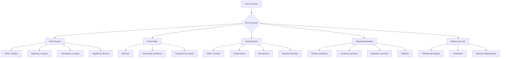
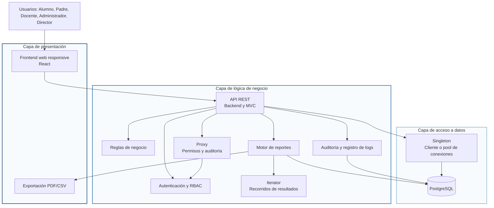
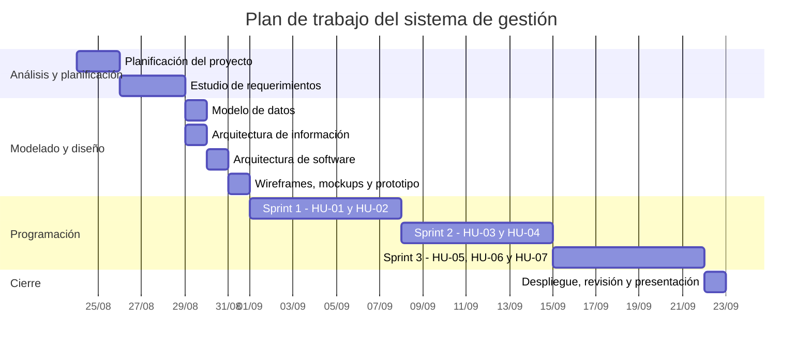
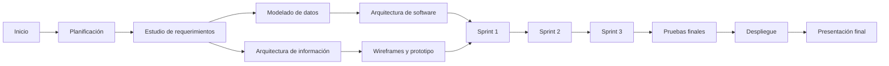

  

    
    
  

  

    <h1>Plan de Trabajo - Proyecto</h1>
    <h2>Centro Educativo "EDUCAR PARA TRANSFORMAR"</h2>
    <h3>Sistema de Gestión</h3>
    
Tecnicatura Universitaria en Programación

    
<strong>Equipo de trabajo</strong>

    
Hakanson, Ian Morales, Elías

  

  <h1>Índice</h1>
  <ul class="index-list">
    <li><a href="#1-descripción-del-proyecto">1. Descripción del Proyecto</a></li>
    <li><a href="#2-objetivos-del-proyecto">2. Objetivos del Proyecto</a></li>
    <li><a href="#3-cronograma-de-actividades---sistema-de-gestión">3. Cronograma de Actividades - Sistema de Gestión</a></li>
    <li><a href="#4-diagrama-de-gantt">4. Diagrama de Gantt</a></li>
    <li><a href="#5-diagrama-de-pert">5. Diagrama de PERT</a></li>
    <li><a href="#6-backlog-de-los-sprints">6. Backlog de los Sprints</a></li>
    <li><a href="#7-plan-de-sprint">7. Plan de Sprint</a></li>
    <li><a href="#8-entregables">8. Entregables</a></li>
    <li><a href="#9-referencias">9. Referencias</a></li>
  </ul>

# Plan de Trabajo - Proyecto

## Centro Educativo "EDUCAR PARA TRANSFORMAR"

### Sistema de Gestión

## Nombre del Equipo de Trabajo

**Equipo de desarrollo del sistema de gestión educativo**

## Apellido y Nombre del Equipo de Trabajo

- Hakanson, Ian
- Morales, Elías

---

# 1. Descripción del Proyecto

## 1.1 Problema

El centro educativo privado "EDUCAR PARA TRANSFORMAR", ubicado en las afueras de la ciudad de Resistencia, iniciará sus actividades en marzo de 2027. La institución necesita automatizar y centralizar sus procesos académicos, administrativos, deportivos y de servicios (Centro Educativo EDUCAR PARA TRANSFORMAR, 2026).

Actualmente, la información de alumnos, padres, docentes, cursos, materias, deportes, horarios, transporte y comedor puede encontrarse dispersa y resultar difícil de actualizar o consultar. Esta situación puede producir duplicación de datos, errores en las inscripciones, conflictos de horarios y dificultades para generar información para la toma de decisiones.

El proyecto propone desarrollar un sistema web de gestión que permita administrar la información de manera integrada, segura y consistente. El sistema tendrá portales diferenciados para alumnos, padres, docentes, administradores y Dirección, con acceso controlado según el rol de cada usuario.

La página web institucional y la aplicación móvil forman parte del escenario general de automatización, pero el alcance de este plan se concentra en el sistema de gestión.

## 1.2 Requerimientos Funcionales

### Módulo: Alumno

- **RF-AL-01 - Consulta de información personal y académica:** El sistema debe permitir al alumno consultar su información personal y académica.
- **RF-AL-02 - Actualización de datos de contacto:** El sistema debe permitir al alumno actualizar su correo electrónico y teléfono.
- **RF-AL-03 - Inscripción a actividades deportivas:** El sistema debe permitir al alumno inscribirse a actividades deportivas.
- **RF-AL-04 - Inscripción al transporte:** El sistema debe permitir al alumno inscribirse a un recorrido del servicio de transporte.
- **RF-AL-05 - Inscripción al comedor:** El sistema debe permitir al alumno inscribirse al servicio de comedor.
- **RF-AL-06 - Generación del reporte de alumno:** El sistema debe permitir al alumno generar un reporte propio con su información académica, deportiva y de servicios.

### Módulo: Padre

- **RF-PA-01 - Consulta de información de los hijos:** El sistema debe permitir al padre consultar los profesores y deportes de sus hijos asociados.
- **RF-PA-02 - Inscripción de los hijos al cursado:** El sistema debe permitir al padre inscribir a sus hijos al cursado del año lectivo.
- **RF-PA-03 - Acceso restringido a hijos asociados:** El sistema debe permitir al padre acceder exclusivamente a la información de sus hijos asociados.

### Módulo: Docente

- **RF-PR-01 - Consulta del perfil profesional:** El sistema debe permitir al docente consultar su perfil profesional, materias, cursos y niveles.
- **RF-PR-02 - Actualización de datos de contacto:** El sistema debe permitir al docente actualizar su correo electrónico y teléfono.
- **RF-PR-03 - Consulta de carga horaria:** El sistema debe permitir al docente consultar su carga horaria.
- **RF-PR-04 - Listado de alumnos:** El sistema debe permitir al docente generar listados de alumnos por curso y materia.
- **RF-PR-05 - Generación del reporte docente:** El sistema debe permitir al docente generar un reporte con los cursos a su cargo por nivel y sus horarios.

### Módulo: Administrador

- **RF-AD-01 - Gestión académica e inscripciones:** El sistema debe permitir al administrador gestionar alumnos, padres, docentes, niveles, cursos, materias, deportes, horarios e inscripciones.
- **RF-AD-02 - Gestión de servicios institucionales:** El sistema debe permitir al administrador gestionar los servicios de transporte y comedor.
- **RF-AD-03 - Gestión de usuarios y permisos:** El sistema debe permitir al administrador gestionar usuarios y asignar roles y permisos.
- **RF-AD-04 - Gestión de reportes institucionales:** El sistema debe permitir al administrador generar y consultar los reportes institucionales autorizados.

### Módulo: Director

- **RF-DI-01 - Gestión de plantillas de reportes:** El sistema debe permitir al Director crear, editar, activar y desactivar plantillas de reportes.
- **RF-DI-02 - Configuración de parámetros:** El sistema debe permitir al Director seleccionar entidades y parámetros para los reportes.
- **RF-DI-03 - Generación de reportes institucionales:** El sistema debe permitir al Director generar reportes institucionales para la toma de decisiones.

## 1.3 Requerimientos No Funcionales

- **RNF-01 - Autenticación y control de acceso:** El sistema debe autenticar a los usuarios y aplicar control de acceso basado en roles.
- **RNF-02 - Privacidad de la información:** Cada usuario debe acceder solo a la información autorizada.
- **RNF-03 - Integridad de datos:** La base de datos debe mantener integridad referencial y evitar duplicados.
- **RNF-04 - Concurrencia y disponibilidad:** El sistema debe soportar accesos concurrentes de los usuarios autorizados.
- **RNF-05 - Usabilidad y diseño responsive:** La interfaz debe ser clara y adaptable a computadoras y dispositivos móviles.
- **RNF-06 - Mantenibilidad y versionado:** El código debe organizarse por capas y mantenerse en un repositorio versionado.
- **RNF-07 - Auditoría de operaciones:** Las operaciones administrativas importantes deben quedar registradas para auditoría.

## 1.4 Reglas de Negocio Principales

- **RN-01 - Límite de inscripciones deportivas:** Un alumno puede inscribirse como máximo a dos deportes simultáneamente.
- **RN-02 - Prevención de conflictos de horarios:** El sistema debe impedir conflictos de horarios entre actividades deportivas.
- **RN-03 - Unicidad de alumno y curso:** Cada alumno pertenece a un único curso y cada curso pertenece a un único nivel educativo.
- **RN-04 - Relación padre-hijo:** Un padre puede tener uno o varios hijos asociados, pero solo puede consultar y gestionar esos hijos.
- **RN-05 - Cantidad de recorridos de transporte:** El servicio de transporte tiene exactamente cuatro recorridos.
- **RN-06 - Prevención de inscripciones duplicadas:** No se permiten inscripciones duplicadas.
- **RN-07 - Control de acceso por roles:** Cada usuario debe acceder únicamente a los módulos y datos permitidos por su rol.
- **RN-08 - Asignación académica:** Una materia puede dictarse en diferentes cursos y puede tener distintos profesores según el curso.
- **RN-09 - Organización de actividades deportivas:** Cada deporte debe tener un docente responsable y puede tener grupos diferentes según nivel y horario.

## 1.5 Tipo de Sistema de Información

El sistema es de naturaleza híbrida:

- **TPS - Sistema de Procesamiento de Transacciones:** procesa inscripciones, altas, modificaciones, asignaciones y uso de servicios.
- **MIS - Sistema de Información Gerencial:** transforma los datos operativos en reportes para la Administración y la Dirección.

## 1.6 Arquitectura de la Información

La información se organizará mediante portales definidos por rol:

### Gráfico de la Arquitectura de la Información

<strong>Figura 1</strong> <em>Arquitectura de la información y navegación por rol.</em>

El gráfico muestra el punto de entrada del sistema, la selección del rol y las vistas disponibles para cada tipo de usuario. Esta organización reduce la complejidad de navegación y evita que un usuario acceda a módulos que no le corresponden.

## 1.7 Arquitectura de la Aplicación de Software

### Aplicación de Principios

- **Separación de responsabilidades:** La presentación gestionará las vistas por rol, el backend aplicará las reglas de negocio y PostgreSQL almacenará la información persistente.
- **Seguridad por diseño:** La autenticación y la autorización RBAC se validarán en el backend para proteger especialmente la información de los hijos y los reportes institucionales.
- **Integridad de datos:** Las inscripciones deportivas, los conflictos de horarios, los recorridos de transporte y los registros duplicados se controlarán tanto en la lógica de negocio como en la base de datos.
- **Bajo acoplamiento y alta cohesión:** Los módulos de alumnos, padres, docentes, administración y Dirección se comunicarán mediante la API sin depender directamente de la interfaz de otro módulo.

### Gráfico de Arquitectura de Software

<strong>Figura 2</strong> <em>Arquitectura de software de tres capas y aplicación de patrones de diseño.</em>

El gráfico muestra el flujo desde los usuarios hacia la presentación, la lógica de negocio y la persistencia. También ubica explícitamente los patrones `Iterator`, `Proxy` y `Singleton` dentro de los componentes donde serán aplicados.

### Componentes

- Aplicación frontend web.
- API REST del backend.
- Módulo de autenticación y autorización RBAC.
- Módulo de alumnos y padres.
- Módulo de docentes.
- Módulo de Administración.
- Módulo de Dirección.
- Motor de reportes.
- Módulo de auditoría y registro de logs.
- Base de datos relacional.

### Componentes Funcionales

1. Gestión de usuarios, roles y permisos.
2. Gestión académica: niveles, cursos, materias y horarios.
3. Gestión de alumnos, padres y docentes.
4. Gestión de actividades deportivas.
5. Gestión de transporte y comedor.
6. Inscripciones y validaciones de negocio.
7. Reportes operativos e institucionales.
8. Auditoría de operaciones y registro de logs.
9. Alertas y notificaciones como funcionalidad adicional.

### Restricciones

- El sistema debe respetar el acceso basado en roles.
- Un alumno no puede superar dos deportes.
- No se permiten conflictos de horarios deportivos.
- Un alumno solo puede tener un recorrido de transporte activo.
- Deben mantenerse exactamente cuatro recorridos de transporte.
- No deben duplicarse inscripciones ni usuarios según las claves definidas.
- Los cambios administrativos deben poder auditarse.

### Conectores

- Frontend y backend: HTTP/HTTPS mediante API REST y JSON.
- Backend y base de datos: ORM o repositorio de persistencia.
- Backend y motor de reportes: servicio interno con consultas autorizadas.
- Equipo y repositorio: Git mediante GitHub o GitLab.
- Equipo y gestión: tablero Kanban en Jira, GitHub Projects u otra herramienta equivalente.

### Tipo de Arquitectura de Software

Se utilizará una arquitectura web de tres capas, complementada con el patrón MVC:

1. **Capa de presentación:** Interfaz web y componentes visuales.
2. **Capa de lógica de negocio:** Casos de uso, validaciones, autenticación y autorización.
3. **Capa de acceso a datos:** Repositorios, ORM y base de datos relacional.

### Patrones de Diseño de Software

Se incorporarán los patrones Iterator, Proxy y Singleton para resolver problemas concretos del sistema. La aplicación de cada patrón se realizará en la capa donde aporta mayor beneficio y no se utilizará únicamente como una formalidad del diseño.

| Patrón | Lugar de aplicación | Problema que resuelve |
|---|---|---|
| Iterator | Servicios de reportes y recorridos de resultados de consultas | Permite iterar registros sin exponer la estructura interna de la colección. |
| Proxy | Servicios de inscripción y operaciones administrativas | Agrega autorización y registra logs después de ejecutar la operación. |
| Singleton | Cliente o pool de conexiones a PostgreSQL | Evita crear múltiples instancias de configuración de acceso a la base de datos. |

### Tecnologías Previstas

Las tecnologías definitivas se seleccionarán durante la etapa de diseño. La propuesta inicial es:

- **Backend:** Node.js con una API REST.
- **Frontend:** React.
- **Gestor de base de datos:** PostgreSQL.
- **Autenticación:** Sesiones seguras o tokens JWT.
- **Reportes:** Generación en pantalla y exportación opcional a PDF o CSV.
- **Repositorio:** GitHub.
- **Gestión del proyecto:** Jira o GitHub Projects.

### Backend

El backend implementará la API REST y concentrará las reglas que afectan la consistencia del sistema. Validará el rol del usuario, la relación padre-hijo, el límite de dos deportes, los conflictos de horarios, la unicidad de las inscripciones y la selección de un único recorrido de transporte. También gestionará los reportes y el registro de auditoría.

### Frontend

El frontend implementará portales diferenciados para alumnos, padres, docentes, administradores y Dirección. Mostrará formularios de inscripción, consultas académicas, listados y reportes, enviando las operaciones a la API para que las validaciones no dependan únicamente de la interfaz. La interfaz será responsive para facilitar el acceso de padres y alumnos desde dispositivos móviles.

### Gestor de Base de Datos

Se utilizará PostgreSQL para modelar alumnos, padres, docentes, niveles, cursos, materias, deportes, grupos, horarios, servicios e inscripciones. Se definirán claves foráneas, restricciones de unicidad y transacciones para evitar duplicados y mantener consistencia cuando se procesen inscripciones simultáneas.

### Maquetación

- **Wireframes:** Se realizarán en Excalidraw para definir la estructura y el flujo de las pantallas de inicio de sesión, portales por rol, inscripciones y reportes.
- **Mockups:** Se realizarán en Figma para definir la apariencia visual, la jerarquía de la información, los formularios y las tablas.
- **Prototipo:** Se construirá en Figma a partir de los mockups para validar la navegación antes de iniciar la codificación.

Las pantallas mínimas a prototipar son inicio de sesión, portal del alumno, consulta del padre, portal docente, panel administrador, inscripción deportiva, inscripción al transporte y reportes de Dirección.

### Repositorio de Software

El código se alojará en un repositorio privado de GitHub. Se utilizarán ramas para funcionalidades, revisiones mediante pull requests y mensajes de commit descriptivos. También se almacenarán allí el `README`, la documentación técnica, los diagramas y las evidencias de pruebas.

## 1.8 Gestión del Proyecto

Se utilizará un tablero Kanban con las columnas **Backlog**, **To Do**, **In Progress**, **Review**, **Done** y **Blocked**. Cada tarea tendrá un responsable, estimación, estado y evidencia.

La bitácora deberá registrar:

- Reuniones y decisiones del equipo.
- Tareas asignadas a cada integrante.
- Avances y bloqueos.
- Revisiones de código.
- Pruebas ejecutadas y resultados.
- Entregables de cada sprint.

## 1.9 Integrantes y Responsabilidades

| Integrante | Responsabilidades principales |
|---|---|
| Ian Hakanson | Coordinación técnica, modelado de datos, backend, seguridad y documentación de arquitectura |
| Elías Morales | Análisis funcional, frontend, maquetación, pruebas y documentación de historias y casos de uso |
| Ambos | Planificación, revisión de código, integración, demostraciones y presentación final |

## 1.10 Formato de Presentación

El documento seguirá una adaptación de las normas APA, de acuerdo con las indicaciones de la cátedra. Se utilizarán citas parentéticas y una sección final de referencias con formato autor-fecha.

- Papel A4.
- Márgenes: 2,5 cm superior, 2 cm inferior, 2,5 cm izquierdo y 2 cm derecho.
- Fuente Calibri, tamaño 11, con estilo normal para el cuerpo del texto.
- Interlineado simple y texto de los párrafos justificado.
- Sangría de primera línea de 1,27 cm para los párrafos del cuerpo.
- Sangría francesa de 1,27 cm para las referencias.
- Figuras y tablas numeradas con título o leyenda explicativa.

# 2. Objetivos del Proyecto

Los objetivos se expresan utilizando el formato SMART: específicos, medibles, logrables, relevantes y con un límite temporal claro.

## Objetivo General

Desarrollar entre el 1 y el 22 de septiembre de 2026 un sistema web de gestión para "EDUCAR PARA TRANSFORMAR" que centralice la información académica, extracurricular y de servicios, aplique control de acceso por roles y cumpla los criterios de aceptación de las historias priorizadas.

## Objetivos Específicos

1. **Analizar y documentar el alcance completo antes del 31/08/2026.** Específico: incluir requisitos, reglas de negocio, historias y casos de uso. Medible: documentar el 100% de los elementos identificados. Lograble: se utilizarán los documentos entregados por la cátedra y las reuniones del equipo. Relevante: establecerá una base común antes de programar. Temporal: límite del 31/08/2026.
2. **Diseñar la solución antes del 31/08/2026.** Específico: completar el modelo de datos, la arquitectura de información, la arquitectura de software, los wireframes, los mockups y el prototipo. Medible: entregar cada artefacto definido y revisarlo con el equipo. Lograble: se reutilizarán los requisitos ya analizados. Relevante: reducirá errores y retrabajo durante la codificación. Temporal: límite del 31/08/2026.
3. **Implementar las siete historias de usuario entre el 01/09/2026 y el 21/09/2026.** Específico: desarrollar las funcionalidades de inscripción, consulta, usuarios, reportes y transporte. Medible: completar HU-01 y HU-02 en el Sprint 1, HU-03 y HU-04 en el Sprint 2, y HU-05, HU-06 y HU-07 en el Sprint 3. Lograble: se distribuirá el trabajo en tres sprints semanales. Relevante: cubrirá las funciones prioritarias del sistema. Temporal: límite de implementación del 21/09/2026.
4. **Validar la solución antes del 22/09/2026.** Específico: ejecutar pruebas funcionales, de integración, de permisos, de duplicados y de conflictos horarios. Medible: verificar el 100% de los criterios de aceptación y registrar los resultados. Lograble: se utilizarán casos y datos de prueba definidos por el equipo. Relevante: garantizará la seguridad y consistencia del sistema. Temporal: límite del 22/09/2026.
5. **Entregar y demostrar el proyecto el 22/09/2026.** Específico: publicar la versión estable en el entorno de pruebas y presentar la documentación completa. Medible: entregar el sistema, el repositorio, la bitácora Kanban, los diagramas, las evidencias y la presentación. Lograble: se reservará el 22/09/2026 para despliegue, revisión final y demostración. Relevante: permitirá evaluar el resultado completo del proyecto. Temporal: 22/09/2026.

---

# 3. Cronograma de Actividades - Sistema de Gestión

Las horas son estimaciones iniciales para el trabajo del equipo. El campo responsable identifica al integrante que coordina la tarea; ambos integrantes participan en las actividades de integración y revisión.

| Etapa | Tareas | Duración en hs | Resultados esperados | Responsable |
|---|---|---:|---|---|
| Planificación del proyecto | Definir alcance, equipo, roles, riesgos, repositorio, tablero y calendario | 4 | Acta inicial, tablero Kanban y repositorio creados | Ambos |
| Planificación del proyecto | Descomponer historias en tareas y estimar puntos y horas | 3 | Backlog priorizado y plan de sprints | Ian |
| Estudio de requerimientos | Revisar escenario, requisitos, reglas de negocio y alcance | 5 | Requisitos funcionales y no funcionales validados | Elías |
| Estudio de requerimientos | Corregir historias, criterios de aceptación y casos de uso | 6 | Catálogo consistente de HU y CU | Elías |
| Modelado | Diseñar modelo entidad-relación y diccionario de datos | 8 | Modelo de datos normalizado | Ian |
| Modelado | Modelar roles, permisos, inscripciones y restricciones | 5 | Matriz RBAC y reglas de integridad | Ian |
| Modelado | Completar arquitectura de información y mapa de navegación | 4 | Mapa del sitio lógico | Elías |
| Diseño | Diseñar arquitectura de tres capas y contratos de API | 6 | Diagrama técnico y endpoints definidos | Ian |
| Diseño | Crear wireframes, mockups y prototipo navegable | 8 | Prototipo de los flujos principales | Elías |
| Diseño | Definir componentes visuales y criterios responsive | 4 | Guía visual inicial | Elías |
| Codificación | Configurar proyecto, base de datos y autenticación | 8 | Estructura ejecutable y acceso seguro | Ian |
| Codificación | Implementar módulos de alumnos, padres y docentes | 12 | Portales y consultas básicas funcionales | Ambos |
| Codificación | Implementar deportes, horarios, transporte y comedor | 12 | Inscripciones y validaciones operativas | Ian |
| Codificación | Implementar Administración, RBAC y reportes | 14 | Panel administrativo y reportes funcionales | Ambos |
| Codificación | Implementar frontend y validaciones de formularios | 14 | Interfaces responsive conectadas a la API | Elías |
| Pruebas | Crear casos de prueba y datos de prueba | 4 | Plan de pruebas y datos controlados | Elías |
| Pruebas | Ejecutar pruebas funcionales y de integración | 10 | Evidencias y defectos registrados | Ambos |
| Pruebas | Ejecutar pruebas de permisos, duplicados y conflictos horarios | 6 | Reglas críticas verificadas | Ian |
| Pruebas | Corregir errores y realizar regresión | 8 | Versión estable candidata a entrega | Ambos |
| Implementación o despliegue | Preparar variables de entorno y base de datos de prueba | 4 | Entorno configurado | Ian |
| Implementación o despliegue | Desplegar aplicación y ejecutar smoke tests | 5 | Sistema disponible en entorno de pruebas | Ian |
| Implementación o despliegue | Completar documentación, bitácora y presentación | 6 | Entrega final completa | Ambos |

**Estimación total:** 162 horas de trabajo del equipo.

## 3.1 Calendario de Sprints

El ciclo de programación comenzará el 01/09/2026 y finalizará el 22/09/2026. Cada sprint tendrá una duración semanal; el 22/09/2026 se reservará para el despliegue, la revisión final y la presentación del proyecto.

| Sprint o etapa | Fecha de inicio | Fecha de finalización | Requerimientos incluidos | Resultado principal |
|---|---|---|---|---|
| Sprint 1 | 01/09/2026 | 07/09/2026 | HU-01 y HU-02 | Inscripción a deportes y consulta segura de información familiar |
| Sprint 2 | 08/09/2026 | 14/09/2026 | HU-03 y HU-04 | Actualización de contacto y gestión de usuarios y roles |
| Sprint 3 | 15/09/2026 | 21/09/2026 | HU-05, HU-06 y HU-07 | Reportes docentes, transporte y plantillas de reportes institucionales |
| Cierre y presentación | 22/09/2026 | 22/09/2026 | Integración de todos los requerimientos | Despliegue, revisión final y demostración |

---

# 4. Diagrama de Gantt

La preparación se realizará antes del inicio de los sprints. La etapa de programación se desarrollará del 01/09/2026 al 21/09/2026 y el cierre del proyecto se realizará el 22/09/2026.

Las fechas son referenciales y deben ajustarse al calendario real de la cátedra.

---

# 5. Diagrama de PERT

La ruta crítica estimada es: planificación, requerimientos, modelado, diseño técnico, Sprint 1, Sprint 2, Sprint 3, pruebas finales y despliegue.

---

# 6. Backlog de los Sprints

## HU-01 - Inscripción a Deportes

| ID | Título / Historia de Usuario | Prioridad | Estado |
|---|---|---|---|
| HU-01 | Como Alumno, quiero inscribirme a actividades deportivas para participar en propuestas extracurriculares | Alta | To Do |

**Tareas:**

1. Diseñar catálogo de deportes, grupos y horarios.
2. Implementar consulta de actividades disponibles.
3. Implementar inscripción deportiva.
4. Validar máximo de dos deportes activos.
5. Validar conflictos de horarios.
6. Registrar deporte, grupo, horario y docente responsable.
7. Ejecutar pruebas funcionales y de concurrencia.

**Criterios de aceptación:**

- El catálogo muestra deportes y grupos disponibles.
- Se bloquea el tercer deporte.
- Se bloquean horarios superpuestos.
- La inscripción confirmada queda asociada al alumno.

## HU-02 - Consulta de Información Académica

| ID | Título / Historia de Usuario | Prioridad | Estado |
|---|---|---|---|
| HU-02 | Como Padre, quiero consultar la información académica y deportiva de mis hijos | Alta | To Do |

**Tareas:**

1. Modelar la relación padre-hijo.
2. Obtener los hijos asociados al usuario autenticado.
3. Mostrar profesores por materia y deportes activos.
4. Implementar autorización por relación padre-hijo.
5. Probar acceso autorizado y no autorizado.

**Criterios de aceptación:**

- El padre visualiza únicamente hijos asociados.
- Se muestran profesores y deportes del hijo seleccionado.
- Se rechaza el acceso a alumnos no asociados.
- Se informa si no existen hijos asociados.

## HU-03 - Actualización de Datos de Contacto

| ID | Título / Historia de Usuario | Prioridad | Estado |
|---|---|---|---|
| HU-03 | Como Alumno o Docente, quiero modificar mi correo y teléfono | Media | To Do |

**Tareas:**

1. Crear formulario de edición para ambos roles.
2. Validar campos obligatorios y correo electrónico.
3. Validar permisos para modificar únicamente el perfil propio.
4. Persistir los cambios en la base de datos.
5. Mostrar confirmación o errores.
6. Ejecutar pruebas de validación.

**Criterios de aceptación:**

- El usuario puede modificar sus propios datos.
- Un correo inválido no se guarda.
- Los cambios válidos se persisten.
- Se muestra un mensaje de confirmación.

## HU-04 - Gestión de Usuarios y Roles

| ID | Título / Historia de Usuario | Prioridad | Estado |
|---|---|---|---|
| HU-04 | Como Administrador, quiero gestionar usuarios y roles para controlar el acceso | Crítica | To Do |

**Tareas:**

1. Implementar alta, consulta, edición y desactivación de usuarios.
2. Implementar asignación de roles.
3. Configurar permisos de Alumno, Padre, Docente, Administrador y Director.
4. Evitar usuarios duplicados.
5. Proteger endpoints y vistas según rol.
6. Ejecutar pruebas de seguridad y autorización.

**Criterios de aceptación:**

- Se pueden gestionar usuarios.
- Es obligatorio asignar un rol válido.
- Cada usuario accede solo a sus funciones autorizadas.
- No se permiten duplicados según las claves definidas.

## HU-05 - Listado de Alumnos por Materia

| ID | Título / Historia de Usuario | Prioridad | Estado |
|---|---|---|---|
| HU-05 | Como Docente, quiero generar listados de alumnos de mis materias | Media | To Do |

**Tareas:**

1. Consultar materias y cursos asignados al docente.
2. Generar consulta de alumnos por materia.
3. Mostrar nivel, curso, materia, profesor, alumno y legajo.
4. Aplicar restricciones de acceso.
5. Implementar exportación CSV opcional.
6. Probar listados con distintos docentes.

**Criterios de aceptación:**

- El docente solo ve sus materias y cursos.
- El listado contiene todos los campos requeridos.
- No se expone información de otros docentes.

## HU-06 - Inscripción al Servicio de Transporte

| ID | Título / Historia de Usuario | Prioridad | Estado |
|---|---|---|---|
| HU-06 | Como Alumno, quiero seleccionar un recorrido de transporte | Alta | To Do |

**Tareas:**

1. Configurar los cuatro recorridos disponibles.
2. Mostrar recorridos activos.
3. Implementar inscripción a un recorrido.
4. Validar una única inscripción activa por alumno.
5. Evitar duplicados mediante validación y restricción de base de datos.
6. Ejecutar pruebas funcionales.

**Criterios de aceptación:**

- Se muestran exactamente cuatro recorridos.
- El alumno puede seleccionar un recorrido.
- No puede inscribirse dos veces ni tener recorridos simultáneos.
- La inscripción queda registrada correctamente.

## HU-07 - Configuración de Reportes Institucionales

| ID | Título / Historia de Usuario | Prioridad | Estado |
|---|---|---|---|
| HU-07 | Como Director, quiero configurar plantillas de reportes institucionales | Media | To Do |

**Tareas:**

1. Definir entidades y campos disponibles para reportes.
2. Crear formulario de configuración de plantilla.
3. Validar nombre y selección de parámetros.
4. Guardar, editar, activar y desactivar plantillas.
5. Generar el reporte desde una plantilla autorizada.
6. Probar permisos y resultados.

**Criterios de aceptación:**

- El Director puede elegir entidad y parámetros.
- No se guarda una plantilla sin nombre o campos.
- Las plantillas se pueden administrar.
- Solo usuarios autorizados pueden generar reportes.

---

# 7. Plan de Sprint

## Sprint 1 - Semana 1 (01/09/2026 - 07/09/2026)

**Objetivo:** Implementar la inscripción deportiva y la consulta segura de información de los hijos.

**Requerimientos incluidos:** HU-01 y HU-02.

| Día | Actividades | Resultado esperado |
|---|---|---|
| 01/09 | Modelo de alumnos, padres, cursos, deportes y horarios | Estructura de datos inicial |
| 02/09 | Catálogo de deportes y grupos | Actividades disponibles para consulta |
| 03/09 | Inscripción deportiva y límite de dos deportes | Inscripción básica funcionando |
| 04/09 | Conflictos horarios y consulta padre-hijo | Validaciones y acceso seguro |
| 05/09 | Pruebas, integración y demostración | HU-01 y HU-02 listas para revisión |

## Sprint 2 - Semana 2 (08/09/2026 - 14/09/2026)

**Objetivo:** Implementar la actualización de contacto y la gestión segura de usuarios y roles.

**Requerimientos incluidos:** HU-03 y HU-04.

| Día | Actividades | Resultado esperado |
|---|---|---|
| 08/09 | Formularios de contacto para alumnos y docentes | Edición de datos disponible |
| 09/09 | Validaciones y persistencia | Datos válidos almacenados |
| 10/09 | ABM de usuarios | Gestión de usuarios funcionando |
| 11/09 | Roles, permisos y protección de endpoints | RBAC implementado |
| 12/09 | Pruebas de seguridad, integración y demostración | HU-03 y HU-04 listas para revisión |

## Sprint 3 - Semana 3 (15/09/2026 - 21/09/2026)

**Objetivo:** Completar los reportes docentes, el transporte y la configuración de reportes institucionales.

**Requerimientos incluidos:** HU-05, HU-06 y HU-07.

| Día | Actividades | Resultado esperado |
|---|---|---|
| 15/09 | Listado de alumnos por materia | Reporte docente disponible |
| 16/09 | Filtros y restricciones por docente | Información protegida |
| 17/09 | Recorridos e inscripción al transporte | Transporte funcionando |
| 18/09 | Plantillas y parámetros de reportes | Reportes de Dirección configurables |
| 19/09 | Pruebas finales, correcciones y demostración | Versión candidata a entrega |

## Cierre y Presentación (22/09/2026)

El 22/09/2026 se realizará el despliegue final, la revisión de los criterios de aceptación, la actualización de la bitácora y la presentación del proyecto.

## Definición de Terminado

Una historia se considera terminada cuando cumple sus criterios de aceptación, incluye validaciones de error, fue probada, revisada por el equipo, integrada al repositorio y desplegada en el entorno de pruebas.

---

# 8. Entregables

Los entregables se definirán según los resultados verificables de cada sprint y de la etapa de cierre.

## 8.1 Entregables del Sprint 1 (01/09/2026 - 07/09/2026)

- Catálogo de deportes, grupos y horarios disponibles.
- Funcionalidad de inscripción a deportes.
- Validación del límite de dos deportes por alumno.
- Validación y bloqueo de conflictos de horarios.
- Consulta de información académica y deportiva de los hijos asociados.
- Control de acceso padre-hijo probado.
- Casos de prueba y demostración de HU-01 y HU-02.

## 8.2 Entregables del Sprint 2 (08/09/2026 - 14/09/2026)

- Formularios de actualización de correo y teléfono para alumnos y docentes.
- Validaciones de datos de contacto y persistencia en la base de datos.
- Gestión de usuarios, estados, roles y permisos.
- Protección de vistas y endpoints mediante RBAC.
- Pruebas funcionales, de integración y de seguridad de HU-03 y HU-04.
- Demostración de HU-03 y HU-04 integrada al repositorio.

## 8.3 Entregables del Sprint 3 (15/09/2026 - 21/09/2026)

- Listado de alumnos por materia para docentes, limitado a sus asignaciones.
- Configuración de los cuatro recorridos de transporte.
- Funcionalidad de inscripción a un único recorrido por alumno.
- Prevención de inscripciones duplicadas en transporte.
- Plantillas de reportes institucionales configurables por el Director.
- Generación de reportes con sus parámetros autorizados.
- Pruebas finales de HU-05, HU-06 y HU-07.

## 8.4 Entregables de cierre (22/09/2026)

- Versión estable desplegada en el entorno de pruebas.
- Código fuente integrado en el repositorio de GitHub.
- Modelo de datos y diccionario de datos actualizados.
- Diagramas de arquitectura de la información y de la aplicación de software.
- Wireframes, mockups y prototipo de los flujos principales.
- Evidencias de pruebas y correcciones realizadas.
- Tablero Kanban y bitácora del equipo y de cada integrante.
- Documentación final del proyecto y presentación de cierre.

# 9. Referencias

Centro Educativo EDUCAR PARA TRANSFORMAR. (2026). <em>Escenario del sistema de gestión</em> [Documento de trabajo].

Cátedra de Metodología de Sistemas II. (2026). <em>Formato de plan de trabajo - Proyecto</em> [Consigna de trabajo].

Hakanson, I., &amp; Morales, E. (2026). <em>Requerimientos, historias de usuario y casos de uso</em> [Documento de trabajo].

Equipo de trabajo. (2026). <em>Planificación de sprints</em> [Documento de trabajo].

