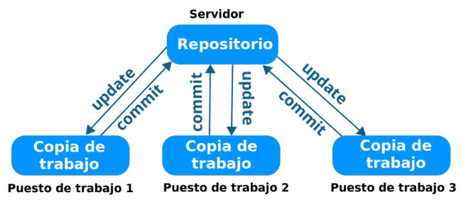
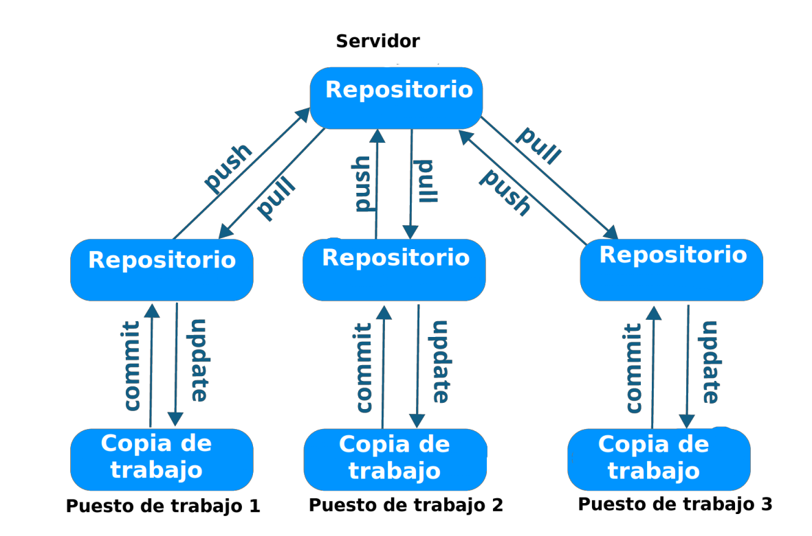

<div class="cover">
  <div class="cover-logos">
    
    
  </div>

  <div class="cover-content">
    <h1>Trabajo Práctico Unidad 1 - Parte 2</h1>
    <h2>Repositorios de Software</h2>
    <h3>Metodología de Sistemas II</h3>
    <p class="cover-career">Tecnicatura Universitaria en Programación</p>
    <p><strong>Proyecto:</strong> Sistema de Gestión del Centro Educativo "EDUCAR PARA TRANSFORMAR"</p>
    <p><strong>Estudiantes</strong></p>
    <p>Ian Hakanson<br>Elías Morales</p>
    <p><strong>Año:</strong> 2026</p>
  </div>
</div>

<div class="index-page">
  <h1>Índice</h1>
  <ul class="index-list">
    <li><a href="#1-introducción">1. Introducción</a></li>
    <li><a href="#2-traducción-de-términos">2. Traducción de términos</a></li>
    <li><a href="#3-análisis-de-las-afirmaciones">3. Análisis de las afirmaciones</a></li>
    <li><a href="#4-interpretación-de-las-arquitecturas">4. Interpretación de las arquitecturas</a></li>
    <li><a href="#5-portafolio-digital">5. Portafolio digital</a></li>
    <li><a href="#6-selección-del-repositorio-de-software">6. Selección del repositorio de software</a></li>
    <li><a href="#7-buenas-prácticas-propuestas">7. Buenas prácticas propuestas</a></li>
    <li><a href="#8-conclusión">8. Conclusión</a></li>
    <li><a href="#9-bibliografía">9. Bibliografía</a></li>
  </ul>
</div>

# 1. Introducción

El desarrollo de software es una actividad colaborativa en la que diferentes personas trabajan sobre código fuente, documentación, configuraciones, pruebas y otros artefactos. Cuando estos elementos se gestionan sin un mecanismo de control, pueden producirse pérdidas de información, sobrescritura de cambios y dificultades para conocer la evolución del proyecto.

Un repositorio de software es un espacio donde se almacenan y organizan los archivos de un proyecto junto con el historial de modificaciones. Además de conservar el código, permite identificar quién realizó cada cambio, cuándo lo realizó y cuál fue su propósito. También facilita la colaboración, la revisión de código, la gestión de ramas, la automatización y la recuperación de versiones anteriores.

En este trabajo se analizan los conceptos de repositorios de software, sus principales operaciones y las diferencias entre las arquitecturas centralizadas y distribuidas. Finalmente, se selecciona GitHub para organizar el portafolio digital y el proyecto del Centro Educativo "EDUCAR PARA TRANSFORMAR".

# 2. Traducción de términos

La consigna utiliza términos habituales del ecosistema Git. Algunas traducciones no son utilizadas normalmente en el trabajo cotidiano de desarrollo, por lo que se incluye también una explicación de su significado práctico.

| Concepto | Traducción al castellano | Significado y aplicación |
|---|---|---|
| Branch | Rama | Línea de desarrollo independiente. Permite trabajar en una funcionalidad o corrección sin modificar directamente la rama principal. |
| Commit | Confirmación o registro de cambios | Registro permanente de un conjunto de cambios, generalmente acompañado de un mensaje descriptivo. La consigna escribe erróneamente "Commint". |
| Pull | Traer o extraer cambios | Obtiene los cambios de un repositorio remoto y los integra en el repositorio local. |
| Pull Request | Solicitud de incorporación o revisión | Solicitud para que un equipo revise los cambios de una rama y decida si deben incorporarse a otra rama. |
| Push | Enviar o publicar cambios | Envía los commits del repositorio local a un repositorio remoto. |
| Merge | Fusionar o integrar | Combina los cambios de una rama con otra, por ejemplo, una rama de funcionalidad con `main`. |
| Clone | Clonar | Crea una copia local de un repositorio remoto, incluyendo sus archivos y el historial necesario para trabajar. |
| Fork | Bifurcar o crear una copia derivada | Crea una copia independiente de un repositorio en otra cuenta o espacio de trabajo. Es común en proyectos de código abierto. |
| Tag | Etiqueta | Marca una versión específica del proyecto, como `v1.0.0` o `v2.0.0`. |
| Pipeline | Flujo o canalización automatizada | Secuencia de pasos automáticos para compilar, probar, validar y eventualmente desplegar un proyecto. |
| CI/CD | Integración Continua y Entrega Continua o Despliegue Continuo | Prácticas que automatizan la integración de cambios, las pruebas, la entrega y el despliegue del software. La consigna escribe erróneamente "CI/DI". |

## 2.1 Flujo básico de trabajo

Un flujo colaborativo habitual puede resumirse de la siguiente manera:

1. El desarrollador clona el repositorio remoto mediante `clone`.
2. Crea una `branch` para una funcionalidad o corrección.
3. Realiza cambios en los archivos y los registra mediante uno o más `commit`.
4. Actualiza su repositorio local mediante `pull` cuando existen cambios remotos.
5. Envía sus commits al repositorio remoto mediante `push`.
6. Crea un `Pull Request` para solicitar revisión.
7. El equipo revisa los cambios y los incorpora mediante `merge` si cumplen los criterios definidos.
8. Se puede crear un `tag` para identificar una versión estable.

# 3. Análisis de las afirmaciones

## 3.1 Plataformas colaborativas

**Afirmación:** En la actualidad, plataformas como GitHub, GitLab y Bitbucket permiten utilizar repositorios Git en entornos colaborativos, incorporando funcionalidades adicionales como revisión de código, gestión de incidencias, administración de proyectos, automatización, integración continua y entrega continua.

**Veredicto: Verdadera.**

GitHub, GitLab y Bitbucket permiten alojar repositorios Git y agregan servicios para coordinar el trabajo de los equipos. Entre sus funcionalidades se encuentran las ramas, la revisión de código, las incidencias, los tableros de proyectos, la gestión de permisos y las herramientas de CI/CD.

## 3.2 Diferencia entre Git y GitHub

**Afirmación:** Git y GitHub no son exactamente lo mismo: Git es el sistema de control de versiones distribuido, mientras que GitHub es una plataforma que utiliza Git y agrega servicios de colaboración y gestión.

**Veredicto: Verdadera.**

Git es el sistema de control de versiones que puede utilizarse localmente y que permite registrar commits, crear ramas, fusionar cambios y consultar el historial. GitHub es una plataforma en la nube que aloja repositorios Git y proporciona servicios adicionales, como Pull Requests, Issues, Projects y GitHub Actions.

## 3.3 Copias completas en un sistema distribuido

**Afirmación:** Git señala que, en un sistema distribuido, cada clon constituye una copia completa del repositorio y su historial. Esto aporta también una importante capacidad de recuperación ante fallos.

**Veredicto: Verdadera.**

Al clonar un repositorio Git se obtiene una copia local que contiene los archivos y el historial del proyecto. Por este motivo, muchas operaciones pueden realizarse sin conexión permanente al servidor remoto y existen varias copias que pueden contribuir a recuperar el proyecto ante determinados fallos.

## 3.4 Funcionamiento de una arquitectura centralizada

**Afirmación:** En un repositorio con arquitectura centralizada, un servidor central está directamente conectado al puesto de trabajo de cada programador. Todos los programadores pueden actualizar sus puestos de trabajo con los datos presentes en el repositorio o pueden hacer cambios mediante `commit` en los mismos. Cada operación se realiza directamente en el repositorio.

**Veredicto: Falsa en su formulación.**

La arquitectura centralizada sí utiliza un servidor principal que contiene el repositorio y su historial. Sin embargo, el `commit` no se registra en el puesto de trabajo, sino en el repositorio central. El puesto de trabajo contiene una copia de los archivos y se comunica con el servidor para obtener actualizaciones o registrar cambios.

**Corrección:** En una arquitectura centralizada, los desarrolladores trabajan sobre copias locales de los archivos, pero las operaciones de actualización y registro de cambios dependen del servidor central. El repositorio central constituye la fuente principal de información y un posible punto único de fallo.

## 3.5 Funcionamiento de una arquitectura distribuida

**Afirmación:** En un repositorio con arquitectura distribuida, todos los programadores pueden actualizar sus repositorios locales con nuevos datos del servidor central mediante `pull` y persistir cambios en el repositorio principal mediante `push` desde su repositorio local.

**Veredicto: Verdadera con una precisión conceptual.**

En un flujo colaborativo es habitual que el equipo utilice un repositorio remoto compartido como referencia común. Cada desarrollador puede ejecutar `pull` para incorporar cambios remotos y `push` para enviar sus commits.

La precisión necesaria es que una arquitectura distribuida no requiere obligatoriamente un servidor central. Cada repositorio local posee una copia del historial y permite realizar commits sin conexión. El repositorio remoto compartido es una convención de colaboración, no una condición de la arquitectura distribuida.

# 4. Interpretación de las arquitecturas

Las dos imágenes proporcionadas en la consigna representan modelos diferentes de organización de repositorios.

## 4.1 Arquitectura centralizada

<figure class="repository-diagram">
  
  <figcaption>Figura 1. Arquitectura de repositorio centralizada.</figcaption>
</figure>

**Clasificación:** Arquitectura de repositorio centralizada.

**Explicación:** Existe un único repositorio ubicado en un servidor central. Los puestos de trabajo poseen copias de los archivos y deben comunicarse con el servidor para actualizarse o registrar cambios. El historial depende principalmente del servidor y una falla en él puede interrumpir el trabajo del equipo.

En la imagen, todos los puestos de trabajo se conectan directamente con el repositorio del servidor mediante operaciones de actualización (`update`) y registro de cambios (`commit`). El repositorio central es la fuente principal de información y puede constituir un punto único de fallo.

## 4.2 Arquitectura distribuida

<figure class="repository-diagram">
  
  <figcaption>Figura 2. Arquitectura de repositorio distribuida.</figcaption>
</figure>

**Clasificación:** Arquitectura de repositorio distribuida.

**Explicación:** Cada desarrollador posee un repositorio local completo con el historial del proyecto. Los commits pueden realizarse localmente y luego sincronizarse con uno o más repositorios remotos mediante `push` y `pull`. Esto permite trabajar sin conexión permanente y ofrece varias copias del historial.

En la imagen, cada puesto de trabajo tiene una copia de trabajo y un repositorio local. Los repositorios locales pueden sincronizarse con el repositorio remoto compartido, pero el trabajo y los commits locales no dependen permanentemente de ese servidor.

## 4.3 Diferencias principales

| Aspecto | Arquitectura centralizada | Arquitectura distribuida |
|---|---|---|
| Ubicación del historial | Principalmente en el servidor | En cada repositorio local |
| Trabajo sin conexión | Limitado | Posible para la mayoría de las operaciones locales |
| Punto único de fallo | Sí, el servidor central | No necesariamente |
| Registro de commits | Depende del servidor | Puede realizarse localmente |
| Sincronización | Con el repositorio central | Con uno o varios repositorios remotos |
| Ejemplo | SVN, CVS o Perforce | Git o Mercurial |

# 5. Portafolio Digital

## 5.1 Repositorio seleccionado

Se selecciona el repositorio de GitHub del proyecto:

[https://github.com/kahnaisehC/educar-para-transformar](https://github.com/kahnaisehC/educar-para-transformar)

Este repositorio funcionará como portafolio digital porque permitirá reunir, ordenar y conservar las evidencias del trabajo realizado durante el cuatrimestre. No se limitará a almacenar el código fuente: también contendrá la documentación, los diagramas, los planes, las decisiones de diseño y las evidencias de pruebas.

## 5.2 Estructura propuesta

```text
educar-para-transformar/
├── README.md
├── .gitignore
├── docs/
│   ├── assets/
│   ├── Escenario.txt
│   ├── Requerimentos&HistoriasDeUsuario&CasosDeUso.txt
│   ├── PlanificacionDeSprints.txt
│   ├── planDeTrabajo.md
│   ├── planDeTrabajo.css
│   └── tpParte2Repositorios.md
├── frontend/
├── backend/
├── tests/
└── .github/
    └── workflows/
```

La estructura es flexible y puede adaptarse a la implementación final. La carpeta `docs/` concentrará los documentos académicos y técnicos; `frontend/` y `backend/` separarán las capas de la aplicación; `tests/` contendrá las pruebas; y `.github/workflows/` podrá contener automatizaciones de CI/CD.

## 5.3 Organización de la evolución

El portafolio se organizará mediante:

- Commits pequeños y descriptivos para registrar avances concretos.
- Ramas separadas para funcionalidades o correcciones.
- Pull Requests para revisar los cambios antes de incorporarlos a `main`.
- Issues para registrar tareas, errores y decisiones pendientes.
- GitHub Projects para visualizar el trabajo mediante un tablero Kanban.
- Tags para identificar entregas o versiones importantes.
- Un archivo `README.md` con la descripción, objetivos, instalación y forma de uso del proyecto.

Esta organización permite consultar la evolución del proyecto y relacionar cada entregable con las actividades que lo produjeron.

# 6. Selección del Repositorio de Software

## 6.1 Plataforma seleccionada: GitHub

Se selecciona **GitHub** como plataforma para alojar el proyecto del Centro Educativo "EDUCAR PARA TRANSFORMAR". GitHub utiliza Git como sistema de control de versiones distribuido y agrega herramientas de colaboración, revisión, planificación y automatización.

## 6.2 Clasificación

| Criterio | Clasificación del repositorio seleccionado | Justificación |
|---|---|---|
| Arquitectura | Distribuida | Git permite que cada clon posea una copia local del historial y que los commits se realicen sin depender de una conexión permanente. |
| Acceso | Privado durante el desarrollo | El acceso debe limitarse al equipo y a las personas autorizadas mientras el proyecto contiene documentación de trabajo y datos de desarrollo. Podrá hacerse público cuando corresponda. |
| Alojamiento | Remoto o en la nube | El repositorio se aloja en GitHub y puede utilizarse desde diferentes ubicaciones y dispositivos. |
| Contenido y propósito | Repositorio de código fuente y documentación | Almacenará el código, los documentos académicos, los diagramas, las configuraciones, las pruebas y los recursos del proyecto. |
| Modalidad de trabajo | Híbrida | Cada integrante trabajará con un repositorio local y sincronizará los cambios con el repositorio remoto de GitHub. |

## 6.3 Características relevantes

| Funcionalidad de GitHub | Aplicación en el proyecto |
|---|---|
| Repositorios Git | Centralizar el código fuente, la documentación y el historial. |
| Branches | Desarrollar cada funcionalidad sin modificar directamente la rama principal. |
| Commits | Registrar los avances con mensajes claros y trazables. |
| Pull Requests | Revisar los cambios antes de incorporarlos a `main`. |
| Issues | Registrar tareas, errores, consultas y decisiones. |
| Projects | Organizar los sprints y las tareas mediante un tablero Kanban. |
| GitHub Actions | Automatizar pruebas, validaciones y procesos de CI/CD. |
| Tags | Identificar versiones entregables del proyecto. |
| Protección de ramas | Evitar modificaciones directas no revisadas en `main`. |
| Gestión de permisos | Controlar quién puede consultar, modificar o administrar el repositorio. |
| README y documentación | Explicar el objetivo, la instalación, la configuración y el uso del sistema. |

## 6.4 Justificación según la metodología de trabajo

La planificación del proyecto utiliza sprints semanales y un tablero Kanban. GitHub es adecuado porque permite relacionar las tareas del tablero con Issues, trabajar mediante ramas y revisar los cambios con Pull Requests.

El flujo propuesto es el siguiente:

1. Registrar una tarea o historia de usuario en GitHub Projects y, si corresponde, en un Issue.
2. Crear una rama con un nombre relacionado con la tarea, por ejemplo `feature/inscripcion-deportes`.
3. Implementar los cambios y registrar commits significativos.
4. Ejecutar pruebas locales y actualizar la rama mediante `pull` cuando sea necesario.
5. Enviar los commits mediante `push`.
6. Abrir un Pull Request hacia `main`.
7. Revisar el código y corregir las observaciones.
8. Fusionar el Pull Request cuando se cumplan los criterios de aceptación.
9. Actualizar el estado de la tarea en el tablero y crear un tag cuando se complete una versión.

Este flujo mejora la trazabilidad, reduce el riesgo de sobrescribir cambios y permite demostrar la participación individual de cada integrante mediante sus commits, ramas, Issues y Pull Requests.

# 7. Buenas Prácticas Propuestas

Para mantener el repositorio ordenado y seguro se aplicarán las siguientes buenas prácticas:

- Utilizar mensajes de commit concretos, por ejemplo: `Agregar validación de horarios deportivos`.
- Crear ramas separadas para nuevas funcionalidades y correcciones.
- Proteger la rama `main` y evitar modificaciones directas no revisadas.
- Utilizar Pull Requests para revisar e integrar cambios.
- No almacenar contraseñas, tokens, claves privadas ni archivos con información sensible.
- Incorporar un archivo `.gitignore` para excluir `.env`, `node_modules/`, archivos de registro y carpetas generadas.
- Mantener actualizado el `README.md` con el objetivo, los requisitos, la instalación y el uso del sistema.
- Utilizar tags para identificar versiones estables.
- Ejecutar pruebas automáticamente mediante GitHub Actions cuando sea posible.
- Revisar periódicamente los permisos del repositorio.

Estas prácticas son especialmente importantes para el sistema educativo, ya que el proyecto puede manejar información personal de alumnos, padres y docentes. El repositorio debe contener datos de prueba y nunca información personal real sin autorización.

# 8. Conclusión

Un repositorio de software es mucho más que un espacio para almacenar archivos. Permite controlar versiones, conservar el historial, organizar ramas, colaborar, revisar código, automatizar tareas y recuperar estados anteriores del proyecto.

Las arquitecturas centralizadas concentran el repositorio y el historial en un servidor principal, mientras que las arquitecturas distribuidas mantienen copias completas en los repositorios locales de los desarrolladores. Git utiliza el modelo distribuido y permite sincronizar repositorios mediante operaciones como `pull` y `push`.

Para el proyecto del Centro Educativo "EDUCAR PARA TRANSFORMAR" se selecciona GitHub porque combina repositorios Git con herramientas de colaboración, planificación, control de permisos, revisión de código y automatización. Su uso permitirá organizar el portafolio digital, documentar la evolución del proyecto y aplicar un flujo de trabajo compatible con sprints y Kanban.

# 9. Bibliografía

- Vargas, Carolina. *Repositorios de Software*. Unidad 1, Metodología de Sistemas II, 2026.
- Cátedra de Metodología de Sistemas II. *Trabajo Práctico Unidad 1 - Parte 2: Repositorios de Software*, 2026.
- OpenTix. [Sistema de control de versiones](https://www.opentix.es/blog/sistema-de-control-de-versiones/).
- DataCamp. [What is a repository?](https://www.datacamp.com/es/blog/what-is-a-repository).
- GitHub Docs. [About repositories](https://docs.github.com/en/repositories/creating-and-managing-repositories/about-repositories).
